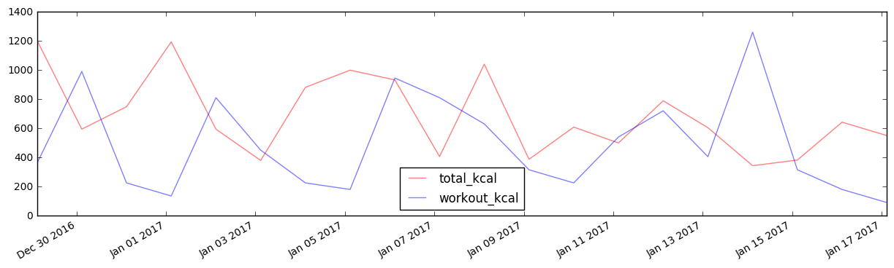
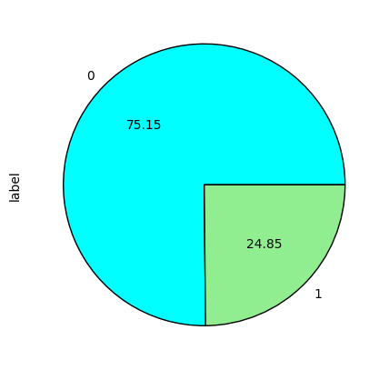
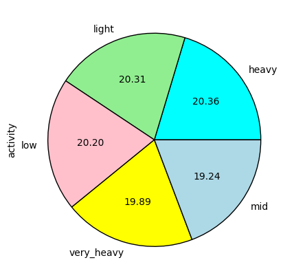
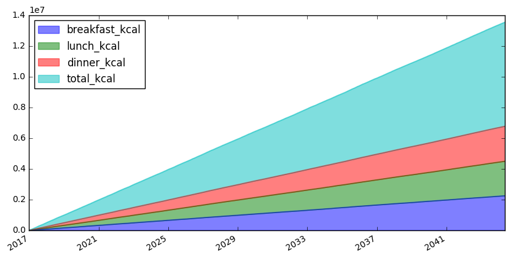

# DietAI
~~~
Yapay sinir ağları ile beslenme koçu oluşturma.

Okuldaki yapayzeka dersi için hazırladığım bu araştırmada temel anlamda bir beslenme koçu
oluşturmaya çalıştım. Projede temel hedefim günlük aldığım ve harcadığım kalorilerin yapayzeka ile
hesabını yapıp kilo alıp almayacağımı öğrenmek.

Malesef veri toplama ve yapay sinir ağı modelini oluşturma kısmında bazı sıkıntılar çektim.
Bu araştırmamı -yetersiz olsa da- bu alanda Türkçe çok az kaynak bulunduğu için paylaşmak istedim.
Umarım benden sonrakilere öncü olur.
~~~
## Gerekli modüller
|Modül adı | Kullanım alanı
-----------|-----------------------
|tempfile | Geçici depolama
|pandas | Veri işleme
|tensorflow | Yapay sinir ağı
|matplotlib | Veri görselleştirme

## Kurulum
~~~
Öncelikle bu projeyi tensorflow yüklenmese dahi sanal ortamda çalıştırmanızı tavsiye ederim.

virtualenv env -p python3 komutu ile sanal ortamı oluşturup,
source env/bin/activate komutu ile aktif edebilirsiniz.
pip3 install -r requirements.txt komutu ile gerekli modülleri kurabilirsiniz. 

Kütüphaneleri elle yüklemek isterseniz
  sudo apt-get install virtualenv - sanal ortam için
  sudo pip3 install tensorflow
  sudo pip3 install pandas
  sudo apt-get install python3-matplotlib
  
 Eğer sorun çıkarsa modüllerin her birinin sitesinde detaylı kurulumları mevcut.
~~~

## Çalıştırma
~~~
jupyter-notebook DietAI.ipynb komutu ile bu dosyayı tarayıcı üstünde adım adım çalıştırabilirsiniz.
Daha çabuk sonuç almak istiyorsanız .py uzantılı dosyayı python3 ile çalıştırın.
~~~


```python
import tempfile
import pandas as pd
import tensorflow as tf
import matplotlib.pyplot as plt
import random
import datetime
%matplotlib inline
```

### Besin Verileri
~~~
Konumuz beslenme olduğu için haliyle besin verilerine ihtiyacımız var.
Aşağıda gördüğünüz ABBREV.csv dosyasında 8194 adet besin kombinasyonunun detaylı bilgileri bulunmakta.
~~~


```python
food_data = pd.DataFrame.from_csv("ABBREV.csv")
food_data.tail()
```


<div>
<table border="1" class="dataframe">
  <thead>
    <tr style="text-align: right;">
      <th></th>
      <th>Shrt_Desc</th>
      <th>Water_(g)</th>
      <th>Energ_Kcal</th>
      <th>Protein_(g)</th>
      <th>Lipid_Tot_(g)</th>
      <th>Ash_(g)</th>
      <th>Carbohydrt_(g)</th>
      <th>Fiber_TD_(g)</th>
      <th>Sugar_Tot_(g)</th>
      <th>Calcium_(mg)</th>
      <th>...</th>
      <th>Vit_K_(µg)</th>
      <th>FA_Sat_(g)</th>
      <th>FA_Mono_(g)</th>
      <th>FA_Poly_(g)</th>
      <th>Cholestrl_(mg)</th>
      <th>GmWt_1</th>
      <th>GmWt_Desc1</th>
      <th>GmWt_2</th>
      <th>GmWt_Desc2</th>
      <th>Refuse_Pct</th>
    </tr>
    <tr>
      <th>No</th>
      <th></th>
      <th></th>
      <th></th>
      <th></th>
      <th></th>
      <th></th>
      <th></th>
      <th></th>
      <th></th>
      <th></th>
      <th></th>
      <th></th>
      <th></th>
      <th></th>
      <th></th>
      <th></th>
      <th></th>
      <th></th>
      <th></th>
      <th></th>
      <th></th>
    </tr>
  </thead>
  <tbody>
    <tr>
      <th>83110</th>
      <td>MACKEREL,SALTED</td>
      <td>43.00</td>
      <td>305</td>
      <td>18.50</td>
      <td>25.10</td>
      <td>13.40</td>
      <td>0.00</td>
      <td>0.0</td>
      <td>0.0</td>
      <td>66.0</td>
      <td>...</td>
      <td>7.8</td>
      <td>7.148</td>
      <td>8.320</td>
      <td>6.210</td>
      <td>95.0</td>
      <td>136.0</td>
      <td>1 cup, cooked</td>
      <td>NaN</td>
      <td>NaN</td>
      <td>0.0</td>
    </tr>
    <tr>
      <th>90240</th>
      <td>SCALLOP,(BAY&amp;SEA),CKD,STMD</td>
      <td>70.25</td>
      <td>111</td>
      <td>20.54</td>
      <td>0.84</td>
      <td>2.97</td>
      <td>5.41</td>
      <td>0.0</td>
      <td>0.0</td>
      <td>10.0</td>
      <td>...</td>
      <td>0.0</td>
      <td>0.218</td>
      <td>0.082</td>
      <td>0.222</td>
      <td>41.0</td>
      <td>85.0</td>
      <td>3 oz</td>
      <td>NaN</td>
      <td>NaN</td>
      <td>0.0</td>
    </tr>
    <tr>
      <th>90480</th>
      <td>SYRUP,CANE</td>
      <td>26.00</td>
      <td>269</td>
      <td>0.00</td>
      <td>0.00</td>
      <td>0.86</td>
      <td>73.14</td>
      <td>0.0</td>
      <td>73.2</td>
      <td>13.0</td>
      <td>...</td>
      <td>0.0</td>
      <td>0.000</td>
      <td>0.000</td>
      <td>0.000</td>
      <td>0.0</td>
      <td>NaN</td>
      <td>NaN</td>
      <td>NaN</td>
      <td>NaN</td>
      <td>0.0</td>
    </tr>
    <tr>
      <th>90560</th>
      <td>SNAIL,RAW</td>
      <td>79.20</td>
      <td>90</td>
      <td>16.10</td>
      <td>1.40</td>
      <td>1.30</td>
      <td>2.00</td>
      <td>0.0</td>
      <td>0.0</td>
      <td>10.0</td>
      <td>...</td>
      <td>0.1</td>
      <td>0.361</td>
      <td>0.259</td>
      <td>0.252</td>
      <td>50.0</td>
      <td>85.0</td>
      <td>3 oz</td>
      <td>NaN</td>
      <td>NaN</td>
      <td>0.0</td>
    </tr>
    <tr>
      <th>93600</th>
      <td>TURTLE,GREEN,RAW</td>
      <td>78.50</td>
      <td>89</td>
      <td>19.80</td>
      <td>0.50</td>
      <td>1.20</td>
      <td>0.00</td>
      <td>0.0</td>
      <td>0.0</td>
      <td>118.0</td>
      <td>...</td>
      <td>0.1</td>
      <td>0.127</td>
      <td>0.088</td>
      <td>0.170</td>
      <td>50.0</td>
      <td>85.0</td>
      <td>3 oz</td>
      <td>NaN</td>
      <td>NaN</td>
      <td>0.0</td>
    </tr>
  </tbody>
</table>
<p>5 rows × 52 columns</p>
</div>


~~~
Yapayzeka modelimizi eğitmek için kişilerin günlük aktiviteleri ile ilgili bilgilerine ihtiyacımız var.
Ben internette bulamadığım için kendi 'yapay' verilerimi oluşturdum.

Öncelikle beslenme alışkanlığını temsil etmek için 24 saat aralıklar ile 10.000 adet zaman verisini içeren
bir tablo oluşturdum. Bu tabloda yaş, kilo, boy, cinsiyet, günlük kalori ihtiyacı, günlük kalori alımı ve 
yakımı ile ilgili bilgiler tutulacak.

Modelle işimi kolaylaştırmak için tablodaki bazı kolonları sabit değerler olarak tanımladım.

~~~


```python
rng = pd.date_range(datetime.datetime.now(), periods=10000, freq='24H')
personal_data = pd.DataFrame(index=rng)
personal_data['age'] = 23
personal_data['weight'] = 75
personal_data['height'] = 176
personal_data['gender'] = "male"
```


```python
personal_data.head()
```


<div>
<table border="1" class="dataframe">
  <thead>
    <tr style="text-align: right;">
      <th></th>
      <th>age</th>
      <th>weight</th>
      <th>height</th>
      <th>gender</th>
    </tr>
  </thead>
  <tbody>
    <tr>
      <th>2016-12-29 02:49:24.148388</th>
      <td>23</td>
      <td>75</td>
      <td>176</td>
      <td>male</td>
    </tr>
    <tr>
      <th>2016-12-30 02:49:24.148388</th>
      <td>23</td>
      <td>75</td>
      <td>176</td>
      <td>male</td>
    </tr>
    <tr>
      <th>2016-12-31 02:49:24.148388</th>
      <td>23</td>
      <td>75</td>
      <td>176</td>
      <td>male</td>
    </tr>
    <tr>
      <th>2017-01-01 02:49:24.148388</th>
      <td>23</td>
      <td>75</td>
      <td>176</td>
      <td>male</td>
    </tr>
    <tr>
      <th>2017-01-02 02:49:24.148388</th>
      <td>23</td>
      <td>75</td>
      <td>176</td>
      <td>male</td>
    </tr>
  </tbody>
</table>
</div>


## Verilerin İşlenmesi
~~~
Besin tablosundan şimdilik işimize yarayacak olan 3 adet kolon var. 
Bunlar besin isimlerini içeren Shrt_Desc, kalori değerini içeren Energ_Kcal ve 
ölçüsünü belirten GmWt_1 kolonları.
~~~


```python
food_data = food_data[['Shrt_Desc', 'Energ_Kcal', 'GmWt_1']]
food_data.head()
```


<div>
<table border="1" class="dataframe">
  <thead>
    <tr style="text-align: right;">
      <th></th>
      <th>Shrt_Desc</th>
      <th>Energ_Kcal</th>
      <th>GmWt_1</th>
    </tr>
    <tr>
      <th>No</th>
      <th></th>
      <th></th>
      <th></th>
    </tr>
  </thead>
  <tbody>
    <tr>
      <th>1001</th>
      <td>BUTTER,WITH SALT</td>
      <td>717</td>
      <td>227.00</td>
    </tr>
    <tr>
      <th>1002</th>
      <td>BUTTER,WHIPPED,WITH SALT</td>
      <td>717</td>
      <td>151.00</td>
    </tr>
    <tr>
      <th>1003</th>
      <td>BUTTER OIL,ANHYDROUS</td>
      <td>876</td>
      <td>205.00</td>
    </tr>
    <tr>
      <th>1004</th>
      <td>CHEESE,BLUE</td>
      <td>353</td>
      <td>28.35</td>
    </tr>
    <tr>
      <th>1005</th>
      <td>CHEESE,BRICK</td>
      <td>371</td>
      <td>132.00</td>
    </tr>
  </tbody>
</table>
</div>


~~~
Günlük kalori ihtiyacını hesaplamak için Harris–Benedict formülünü kullanacağız.
Bu formül için cinsiyet, kilo, boy ve yaş değerlerine ihtiyacımız var.
Formül kadınlar ve erkekler için ağaşıdaki gibi
~~~
$$BMRman = (10 × weight) + (6.25 × height) - (5 × age) + 5$$
$$BMRwoman = (10 × weight) + (6.25 × height) - (5 × age) - 161$$

|Egzersiz Yoğunluğu|Günlük Kilokalori İhtiyacı
|----------------------------------------
|Çok az veya hiç|BMR x 1.2
|Hafif (haftada 1–3 gün)|BMR x 1.375
|Orta (haftada 3–5 gün)|BMR x 1.55
|Ağır(haftada 6–7 gün)|BMR x 1.725
|Çok Ağır (günde 2 kez, ekstra antreman)|BMR x 1.9
[Bu linkten](https://en.wikipedia.org/wiki/Harris%E2%80%93Benedict_equation) daha fazla bilgi edinebilirsiniz.


```python
activites = {"low":lambda x:x*1.2, 
             "light":lambda x:x*1.375, 
             "mid":lambda x:x*1.55, 
             "heavy":lambda x:x*1.725, 
             "very_heavy":lambda x:x*1.9}

def kcal(gender, weight, height, age, activity):
    """ Formüle göre BMR hesaplar ve aktiviteye göre günlük kcal değerini çıkartır"""
    if gender == "male":
        return  activites[activity]((10 * weight) + (6.25 * height) - (5 * age) + 5)
    else:
        return  activites[activity]((10 * weight) + (6.25 * height) - (5 * age) - 161)
```

~~~
Önce tabloya rastgele aktiviteler ekledik. Tablodaki her satıra erişip kcal fonksiyonuna gerekli parametreleri verdik.
Dönen değerlerden bir liste oluşturup bu listeyi kcal -günlük kkalori ihtiyacı- olarak tabloya ekledik
~~~


```python
personal_data['activity'] = [random.choice(list(activites.keys())) for x in range(len(personal_data))]
personal_data['kcal']=[kcal(person[1]['gender'], person[1]['weight'], person[1]['height'], person[1]['age'], person[1]['activity'])
            for person in personal_data.iterrows()]
personal_data.head()
```


<div>
<table border="1" class="dataframe">
  <thead>
    <tr style="text-align: right;">
      <th></th>
      <th>age</th>
      <th>weight</th>
      <th>height</th>
      <th>gender</th>
      <th>activity</th>
      <th>kcal</th>
    </tr>
  </thead>
  <tbody>
    <tr>
      <th>2016-12-29 02:49:24.148388</th>
      <td>23</td>
      <td>75</td>
      <td>176</td>
      <td>male</td>
      <td>very_heavy</td>
      <td>3306.0</td>
    </tr>
    <tr>
      <th>2016-12-30 02:49:24.148388</th>
      <td>23</td>
      <td>75</td>
      <td>176</td>
      <td>male</td>
      <td>very_heavy</td>
      <td>3306.0</td>
    </tr>
    <tr>
      <th>2016-12-31 02:49:24.148388</th>
      <td>23</td>
      <td>75</td>
      <td>176</td>
      <td>male</td>
      <td>heavy</td>
      <td>3001.5</td>
    </tr>
    <tr>
      <th>2017-01-01 02:49:24.148388</th>
      <td>23</td>
      <td>75</td>
      <td>176</td>
      <td>male</td>
      <td>low</td>
      <td>2088.0</td>
    </tr>
    <tr>
      <th>2017-01-02 02:49:24.148388</th>
      <td>23</td>
      <td>75</td>
      <td>176</td>
      <td>male</td>
      <td>very_heavy</td>
      <td>3306.0</td>
    </tr>
  </tbody>
</table>
</div>


~~~
Eğitim verilerini oluşturmak için personal_data tablosundaki vatandaşa rastgele 3 öğün yemek yedireceğiz.
Yemek isimlerini ve kalori değerini de tabloya kolon olarak ekleyeceğiz. Bu işlem uzun sürebilir :)
~~~


```python
personal_data['breakfast'] = [random.choice(list(food_data['Shrt_Desc']))  for x in range(len(personal_data))]
breakfast_kcal = [food_data.loc[food_data['Shrt_Desc'] == x, 'Energ_Kcal'] for x in list(personal_data['breakfast'])]
personal_data['breakfast_kcal'] = [k.iloc[0] for k in breakfast_kcal]

personal_data['lunch'] = [random.choice(list(food_data['Shrt_Desc']))  for x in range(len(personal_data))]
lunch_kcal = [food_data.loc[food_data['Shrt_Desc'] == x, 'Energ_Kcal'] for x in list(personal_data['lunch'])]
personal_data['lunch_kcal'] = [k.iloc[0] for k in lunch_kcal]

personal_data['dinner'] = [random.choice(list(food_data['Shrt_Desc']))  for x in range(len(personal_data))]
dinner_kcal = [food_data.loc[food_data['Shrt_Desc'] == x, 'Energ_Kcal'] for x in list(personal_data['dinner'])]
personal_data['dinner_kcal'] = [k.iloc[0] for k in dinner_kcal]

personal_data['total_kcal'] = personal_data['dinner_kcal'] + personal_data['lunch_kcal'] + personal_data['breakfast_kcal']
```

~~~
Ardından yediklerini yakması için her gün rastgele 1 saat egzersiz yaptıracağız. Elimizdeki egzersiz tablosunda egzersiz isimleri ve kilo başına dakikada yaktırdığı kkalori oranı bulunuyor.
~~~
[Bu linkte](https://www.acefitness.org/updateable/update_display.aspx?pageID=593) detaylar mevcut.


```python
exercise_data = pd.read_csv("activity_costs.csv", sep=";")
exercise_data.head()
```


<div>
<table border="1" class="dataframe">
  <thead>
    <tr style="text-align: right;">
      <th></th>
      <th>Activity</th>
      <th>Energy_Expenditure</th>
    </tr>
  </thead>
  <tbody>
    <tr>
      <th>0</th>
      <td>Racquetball (recreational)</td>
      <td>0.07</td>
    </tr>
    <tr>
      <th>1</th>
      <td>Kayaking (leisure)</td>
      <td>0.04</td>
    </tr>
    <tr>
      <th>2</th>
      <td>Dancing (general)</td>
      <td>0.08</td>
    </tr>
    <tr>
      <th>3</th>
      <td>Golf (walking + bag)</td>
      <td>0.09</td>
    </tr>
    <tr>
      <th>4</th>
      <td>Running (5 mph, 12 min/mile)</td>
      <td>0.12</td>
    </tr>
  </tbody>
</table>
</div>


```python
personal_data['workout'] = [random.choice(list(exercise_data['Activity']))  for x in range(len(personal_data))]
excercise_kcal = [exercise_data.loc[exercise_data['Activity'] == x, 'Energy_Expenditure'] for x in list(personal_data['workout'])]
personal_data['workout_kcal'] = [k.iloc[0] for k in excercise_kcal]
personal_data['workout_kcal'] = personal_data['workout_kcal']*personal_data['weight']*60 # energy_exp * weight * min
personal_data.head()
```


<div>
<table border="1" class="dataframe">
  <thead>
    <tr style="text-align: right;">
      <th></th>
      <th>age</th>
      <th>weight</th>
      <th>height</th>
      <th>gender</th>
      <th>activity</th>
      <th>kcal</th>
      <th>breakfast</th>
      <th>breakfast_kcal</th>
      <th>lunch</th>
      <th>lunch_kcal</th>
      <th>dinner</th>
      <th>dinner_kcal</th>
      <th>total_kcal</th>
      <th>workout</th>
      <th>workout_kcal</th>
    </tr>
  </thead>
  <tbody>
    <tr>
      <th>2016-12-29 02:49:24.148388</th>
      <td>23</td>
      <td>75</td>
      <td>176</td>
      <td>male</td>
      <td>very_heavy</td>
      <td>3306.0</td>
      <td>CANDIES,MARS SNACKFOOD US,SNICKERS CRUNCHER</td>
      <td>488</td>
      <td>RICE,WHITE,STMD,CHINESE RESTAURANT</td>
      <td>151</td>
      <td>SALAD DRSNG,PEPPERCORN DRSNG,COMM,REG</td>
      <td>564</td>
      <td>1203</td>
      <td>Dancing (general)</td>
      <td>360.0</td>
    </tr>
    <tr>
      <th>2016-12-30 02:49:24.148388</th>
      <td>23</td>
      <td>75</td>
      <td>176</td>
      <td>male</td>
      <td>very_heavy</td>
      <td>3306.0</td>
      <td>ASPARAGUS,CND,REG PK,SOL&amp;LIQUIDS</td>
      <td>15</td>
      <td>BEEF,GROUND,75% LN MEAT / 25% FAT,PATTY,CKD,PA...</td>
      <td>248</td>
      <td>BEEF,BRISKET,WHL,LN&amp;FAT,1/8"FAT,ALL GRDS,CKD,BRSD</td>
      <td>331</td>
      <td>594</td>
      <td>Running (7.5 mph 8 min/mile)</td>
      <td>990.0</td>
    </tr>
    <tr>
      <th>2016-12-31 02:49:24.148388</th>
      <td>23</td>
      <td>75</td>
      <td>176</td>
      <td>male</td>
      <td>heavy</td>
      <td>3001.5</td>
      <td>FAST FD,PIZZA CHAIN,14" PIZZA,MEAT &amp; VEG TOPPI...</td>
      <td>244</td>
      <td>FAST FOODS,MINIATURE CINN ROLLS</td>
      <td>403</td>
      <td>SWEET POTATO,CND,MSHD</td>
      <td>101</td>
      <td>748</td>
      <td>Sweeping</td>
      <td>225.0</td>
    </tr>
    <tr>
      <th>2017-01-01 02:49:24.148388</th>
      <td>23</td>
      <td>75</td>
      <td>176</td>
      <td>male</td>
      <td>low</td>
      <td>2088.0</td>
      <td>PORK,FRSH,VAR MEATS&amp;BY-PRODUCTS,EARS,FRZ,RAW</td>
      <td>234</td>
      <td>CHEESE PRODUCT,PAST PROCESS,AMERICAN,RED FAT,F...</td>
      <td>240</td>
      <td>NUTS,PILINUTS,DRIED</td>
      <td>719</td>
      <td>1193</td>
      <td>Sitting Activities (very light)</td>
      <td>135.0</td>
    </tr>
    <tr>
      <th>2017-01-02 02:49:24.148388</th>
      <td>23</td>
      <td>75</td>
      <td>176</td>
      <td>male</td>
      <td>very_heavy</td>
      <td>3306.0</td>
      <td>HORNED MELON (KIWANO)</td>
      <td>44</td>
      <td>MCDONALD'S,BIG 'N TASTY (WITHOUT MAYONNAISE)</td>
      <td>192</td>
      <td>MILK,DRY,NONFAT,INST,WO/ ADDED VIT A &amp; VITAMIN D</td>
      <td>358</td>
      <td>594</td>
      <td>Cycling (stationary, 200W)</td>
      <td>810.0</td>
    </tr>
  </tbody>
</table>
</div>


~~~
Tabloya gerekli tüm verileri ekledik şimdi egzersizde harcanan enerjinin öğünlerden alınanlardan fazla olanları 1 olarak etiketleyeceğiz. Böylece yapay sinir ağı için eğitim datasetini hazırlamış olacağız.
~~~


```python
def calibrate_labels(data_frame):
    """ calculates intake and cost value diff and adds it as label to dataframe """
    data_frame['label'] = data_frame[['total_kcal', 'workout_kcal']].apply(lambda x: x['workout_kcal'] - x['total_kcal'] > 0, axis=1).astype(int)
    return data_frame
```


```python
personal_data = calibrate_labels(personal_data)
personal_data.to_csv("my_data.csv")
personal_data.head()
```


<div>
<table border="1" class="dataframe">
  <thead>
    <tr style="text-align: right;">
      <th></th>
      <th>age</th>
      <th>weight</th>
      <th>height</th>
      <th>gender</th>
      <th>activity</th>
      <th>kcal</th>
      <th>breakfast</th>
      <th>breakfast_kcal</th>
      <th>lunch</th>
      <th>lunch_kcal</th>
      <th>dinner</th>
      <th>dinner_kcal</th>
      <th>total_kcal</th>
      <th>workout</th>
      <th>workout_kcal</th>
      <th>label</th>
    </tr>
  </thead>
  <tbody>
    <tr>
      <th>2016-12-29 02:49:24.148388</th>
      <td>23</td>
      <td>75</td>
      <td>176</td>
      <td>male</td>
      <td>very_heavy</td>
      <td>3306.0</td>
      <td>CANDIES,MARS SNACKFOOD US,SNICKERS CRUNCHER</td>
      <td>488</td>
      <td>RICE,WHITE,STMD,CHINESE RESTAURANT</td>
      <td>151</td>
      <td>SALAD DRSNG,PEPPERCORN DRSNG,COMM,REG</td>
      <td>564</td>
      <td>1203</td>
      <td>Dancing (general)</td>
      <td>360.0</td>
      <td>0</td>
    </tr>
    <tr>
      <th>2016-12-30 02:49:24.148388</th>
      <td>23</td>
      <td>75</td>
      <td>176</td>
      <td>male</td>
      <td>very_heavy</td>
      <td>3306.0</td>
      <td>ASPARAGUS,CND,REG PK,SOL&amp;LIQUIDS</td>
      <td>15</td>
      <td>BEEF,GROUND,75% LN MEAT / 25% FAT,PATTY,CKD,PA...</td>
      <td>248</td>
      <td>BEEF,BRISKET,WHL,LN&amp;FAT,1/8"FAT,ALL GRDS,CKD,BRSD</td>
      <td>331</td>
      <td>594</td>
      <td>Running (7.5 mph 8 min/mile)</td>
      <td>990.0</td>
      <td>1</td>
    </tr>
    <tr>
      <th>2016-12-31 02:49:24.148388</th>
      <td>23</td>
      <td>75</td>
      <td>176</td>
      <td>male</td>
      <td>heavy</td>
      <td>3001.5</td>
      <td>FAST FD,PIZZA CHAIN,14" PIZZA,MEAT &amp; VEG TOPPI...</td>
      <td>244</td>
      <td>FAST FOODS,MINIATURE CINN ROLLS</td>
      <td>403</td>
      <td>SWEET POTATO,CND,MSHD</td>
      <td>101</td>
      <td>748</td>
      <td>Sweeping</td>
      <td>225.0</td>
      <td>0</td>
    </tr>
    <tr>
      <th>2017-01-01 02:49:24.148388</th>
      <td>23</td>
      <td>75</td>
      <td>176</td>
      <td>male</td>
      <td>low</td>
      <td>2088.0</td>
      <td>PORK,FRSH,VAR MEATS&amp;BY-PRODUCTS,EARS,FRZ,RAW</td>
      <td>234</td>
      <td>CHEESE PRODUCT,PAST PROCESS,AMERICAN,RED FAT,F...</td>
      <td>240</td>
      <td>NUTS,PILINUTS,DRIED</td>
      <td>719</td>
      <td>1193</td>
      <td>Sitting Activities (very light)</td>
      <td>135.0</td>
      <td>0</td>
    </tr>
    <tr>
      <th>2017-01-02 02:49:24.148388</th>
      <td>23</td>
      <td>75</td>
      <td>176</td>
      <td>male</td>
      <td>very_heavy</td>
      <td>3306.0</td>
      <td>HORNED MELON (KIWANO)</td>
      <td>44</td>
      <td>MCDONALD'S,BIG 'N TASTY (WITHOUT MAYONNAISE)</td>
      <td>192</td>
      <td>MILK,DRY,NONFAT,INST,WO/ ADDED VIT A &amp; VITAMIN D</td>
      <td>358</td>
      <td>594</td>
      <td>Cycling (stationary, 200W)</td>
      <td>810.0</td>
      <td>1</td>
    </tr>
  </tbody>
</table>
</div>


```python
personal_data.columns
```


    Index(['age', 'weight', 'height', 'gender', 'activity', 'kcal', 'breakfast',
           'breakfast_kcal', 'lunch', 'lunch_kcal', 'dinner', 'dinner_kcal',
           'total_kcal', 'workout', 'workout_kcal', 'label'],
          dtype='object')


~~~
Opsiyonel olarak tablodaki ilk n veriyi test verisi olarak kaydettik. 
İlerde bu programı tekrar çalıştırdığımızda veriler rastgele atanacağı için eski test verileri 
bizim için tutarlı ama farklı değerler olmuş olacak.
~~~
### !!! Bu hücre code türünde olmayabilir !!!
personal_test = personal_data[:1000] # created already
personal_test.to_csv("my_test.csv")
personal_test.head()
## Verileri Görselleştirelim
~~~
Günlük alınan ve harcanan kcal miktarı.
~~~


```python
personal_data[['total_kcal', 'workout_kcal']][:20].plot(color=["r", "b"], figsize=(15, 4), fontsize=10, alpha=0.5)
```


    <matplotlib.axes._subplots.AxesSubplot at 0x7fde892f7b00>





~~~
1. Pastada alınan ve verilen kilo oranlarını,
2. Pastada günlük kalori ihtiyaç türlerinin oranlarını çizdirdik.
~~~


```python
personal_data['label'].value_counts().plot.pie(autopct="%.2f", colors=("cyan", "lightgreen"), figsize=(5, 5));
plt.figure();
personal_data['activity'].value_counts().plot.pie(autopct="%.2f", colors=("cyan", "lightgreen", "pink", "yellow", "lightblue"), figsize=(5, 5));
```








~~~
Öğünlerde alınan kkalorilerin kümülatif toplamı (tüm değerler sırayla toplanır).
~~~


```python
personal_data[['breakfast_kcal', 'lunch_kcal', 'dinner_kcal', 'total_kcal']].cumsum().plot.area(figsize=(10,5), alpha=0.5)
```


    <matplotlib.axes._subplots.AxesSubplot at 0x7fde8440deb8>





# Yapay Sinir Ağı

~~~
Bu örnekte wide and deep learning tekniğini kullandık. 
Basitçe açıklamak gerekirse 'wide' olarak belirlediğimiz kısım ezberleme (Linear Classification),
'deep' olarak belirlediğimiz katmanlı sinir ağı ile sınıflandırma yapacağız.

Wide and deep learning tekniği büyük ölçekli regresyonlar (veriler arasındaki ilişkinin analizi) ve sparse (çok sayıda olası değerlerin bulunduğu veya kategorinin çok sayıda parçaya bölündüğü) sınıflandırma problemlerinde etkili.
~~~
[Burada](https://research.googleblog.com/2016/06/wide-deep-learning-better-together-with.html) wide & deep learning ile ilgili güzel bir blog yazısı var.
[Burada](https://www.tensorflow.org/tutorials/wide_and_deep/) da tensorflowun kendi örneği var.


~~~
Aşağıda sürekli ve kategorisel kolonları ve model için gerekli bazı değişkenleri belirledik.
~~~
### Sürekli
    * age
    * weight
    * height
    * kcal
    * breakfast_kcal
    * lunch_kcal
    * dinner_kcal
    * total_kcal
    * workout_kcal
    
### Kategorsel
    * gender
    * activity
    * breakfast
    * lunch
    * dinner
    * workout


```python
flags = tf.app.flags
FLAGS = flags.FLAGS

flags.DEFINE_string("model_dir", "", "Base directory for output models.")
flags.DEFINE_string("model_type", "wide_n_deep",
                    "Valid model types: {'wide', 'deep', 'wide_n_deep'}.")
flags.DEFINE_string(
    "train_data",
    "",
    "Path to the training data.")
flags.DEFINE_string(
    "test_data",
    "",
    "Path to the test data.")

COLUMNS = ['age', 'weight', 'height', 'gender', 'activity', 'kcal', 'breakfast',
       'breakfast_kcal', 'lunch', 'lunch_kcal', 'dinner', 'dinner_kcal',
       'total_kcal', 'workout', 'workout_kcal', 'label']
LABEL_COLUMN = "label"
CONTINUOUS_COLUMNS =  ['age', 'weight', 'height', 'kcal', 'breakfast_kcal', 'lunch_kcal', 'dinner_kcal', 'total_kcal', 'workout_kcal']
CATEGORICAL_COLUMNS= ["gender", 'activity', 'breakfast', 'lunch', 'dinner', 'workout']
```


```python
def build_estimator(model_dir):
    """ Yapay sinir aği modeli."""
    # Sparse temel kolon
    gender = tf.contrib.layers.sparse_column_with_keys(column_name="gender",
                                                     keys=["female", "male"])
    
    # Surekli
    age = tf.contrib.layers.real_valued_column("age")
    weight = tf.contrib.layers.real_valued_column("weight")
    height = tf.contrib.layers.real_valued_column("height")
    kcal = tf.contrib.layers.real_valued_column("kcal")
    breakfast_kcal = tf.contrib.layers.real_valued_column("breakfast_kcal")
    lunch_kcal = tf.contrib.layers.real_valued_column("lunch_kcal")
    dinner_kcal = tf.contrib.layers.real_valued_column("dinner_kcal")
    total_kcal = tf.contrib.layers.real_valued_column("total_kcal")
    workout_kcal = tf.contrib.layers.real_valued_column("workout_kcal")

    # Kategorisel
    age_buckets = tf.contrib.layers.bucketized_column(age, boundaries=[
                                                        18, 25, 30, 35, 40, 45,
                                                        50, 55, 60, 65])
    
    activity = tf.contrib.layers.sparse_column_with_hash_bucket(
      "activity", hash_bucket_size=5)
    # öğünlerin türü belirlenebilirse hash_bucket_size daha tutarlı tanımlanabilir.
    breakfast = tf.contrib.layers.sparse_column_with_hash_bucket(
      "breakfast", hash_bucket_size=1000)
    lunch = tf.contrib.layers.sparse_column_with_hash_bucket(
      "lunch", hash_bucket_size=1000)
    dinner = tf.contrib.layers.sparse_column_with_hash_bucket(
      "dinner", hash_bucket_size=1000)
    
    workout = tf.contrib.layers.sparse_column_with_hash_bucket(
      "workout", hash_bucket_size=60) # 60 farklı egzersizimiz var
    
    # Wide columns and deep columns.
    wide_columns = [gender, age_buckets, activity, breakfast, lunch, dinner, workout]
    
    
    deep_columns = [
        tf.contrib.layers.embedding_column(gender, dimension=8),
        age,
        weight,
        height,
        kcal,
        breakfast_kcal,
        lunch_kcal,
        dinner_kcal,
        total_kcal,
        workout_kcal
    ]

    if FLAGS.model_type == "wide":
        m = tf.contrib.learn.LinearClassifier(model_dir=model_dir,
                                          feature_columns=wide_columns)
    elif FLAGS.model_type == "deep":
        m = tf.contrib.learn.DNNClassifier(
            model_dir=model_dir,
            feature_columns=deep_columns,
            hidden_units=[200, 100],  # gizli katma ve tensor sayısı
            optimizer=tflearn.optimizers.SGD(learning_rate=0.001), # Adam, SGD, RMSprop, RMSprop, Ftrl, AdaGrad 
            )
    else:
        m = tf.contrib.learn.DNNLinearCombinedClassifier(
            model_dir=model_dir,
            linear_feature_columns=wide_columns,
            dnn_feature_columns=deep_columns,
            dnn_hidden_units=[100, 50])
    return m
```


```python
def input_fn(df):
    """ Kolonları tensorflow sabitlerine dönüştürür ve birleştirir. """
   
    continuous_cols = {k: tf.constant(df[k].values) for k in CONTINUOUS_COLUMNS}
    
    categorical_cols = {k: tf.SparseTensor(
        indices=[[i, 0] for i in range(df[k].size)],
        values=df[k].values,
        shape=[df[k].size, 1])
                      for k in CATEGORICAL_COLUMNS}
    
    feature_cols = dict(continuous_cols)
    feature_cols.update(categorical_cols)
    label = tf.constant(df[LABEL_COLUMN].values)

    return feature_cols, label
```

~~~
Geçici bir klasor içinde modeli oluşturduk.
~~~


```python
model_dir = tempfile.mkdtemp()
m = build_estimator(model_dir) 
```

    WARNING:tensorflow:The default value of combiner will change from "sum" to "sqrtn" after 2016/11/01.
    WARNING:tensorflow:The default value of combiner will change from "sum" to "sqrtn" after 2016/11/01.
    WARNING:tensorflow:The default value of combiner will change from "sum" to "sqrtn" after 2016/11/01.
    WARNING:tensorflow:The default value of combiner will change from "sum" to "sqrtn" after 2016/11/01.
    WARNING:tensorflow:The default value of combiner will change from "sum" to "sqrtn" after 2016/11/01.
    WARNING:tensorflow:The default value of combiner will change from "sum" to "sqrtn" after 2016/11/01.
    WARNING:tensorflow:The default value of combiner will change from "mean" to "sqrtn" after 2016/11/01.
    INFO:tensorflow:Using default config.
    INFO:tensorflow:Using config: {'save_checkpoints_secs': 600, 'keep_checkpoint_every_n_hours': 10000, '_evaluation_master': '', '_task_type': None, '_num_ps_replicas': 0, 'save_checkpoints_steps': None, '_cluster_spec': <tensorflow.python.training.server_lib.ClusterSpec object at 0x7fde843bfc88>, 'keep_checkpoint_max': 5, 'save_summary_steps': 100, 'tf_random_seed': None, '_task_id': 0, '_environment': 'local', '_is_chief': True, '_master': '', 'tf_config': gpu_options {
      per_process_gpu_memory_fraction: 1
    }
    }


~~~
Hazırladığımız tabloyu input_fn fonksiyonu ile tensorflow için hazır hale getirdik ve modelimize
verdik. 2. parametre olarak modeli eğitme işleminin kaç kez gerçekleştirileceğini belirledik.
~~~


```python
train_res = m.fit(input_fn=lambda: input_fn(personal_data), steps=2000)
```

    WARNING:tensorflow:From /usr/local/lib/python3.5/dist-packages/tensorflow/contrib/learn/python/learn/estimators/dnn_linear_combined.py:711 in fit.: calling BaseEstimator.fit (from tensorflow.contrib.learn.python.learn.estimators.estimator) with x is deprecated and will be removed after 2016-12-01.
    Instructions for updating:
    Estimator is decoupled from Scikit Learn interface by moving into
    separate class SKCompat. Arguments x, y and batch_size are only
    available in the SKCompat class, Estimator will only accept input_fn.
    Example conversion:
      est = Estimator(...) -> est = SKCompat(Estimator(...))
    WARNING:tensorflow:From /usr/local/lib/python3.5/dist-packages/tensorflow/contrib/learn/python/learn/estimators/dnn_linear_combined.py:711 in fit.: calling BaseEstimator.fit (from tensorflow.contrib.learn.python.learn.estimators.estimator) with y is deprecated and will be removed after 2016-12-01.
    Instructions for updating:
    Estimator is decoupled from Scikit Learn interface by moving into
    separate class SKCompat. Arguments x, y and batch_size are only
    available in the SKCompat class, Estimator will only accept input_fn.
    Example conversion:
      est = Estimator(...) -> est = SKCompat(Estimator(...))
    WARNING:tensorflow:From /usr/local/lib/python3.5/dist-packages/tensorflow/contrib/learn/python/learn/estimators/dnn_linear_combined.py:711 in fit.: calling BaseEstimator.fit (from tensorflow.contrib.learn.python.learn.estimators.estimator) with batch_size is deprecated and will be removed after 2016-12-01.
    Instructions for updating:
    Estimator is decoupled from Scikit Learn interface by moving into
    separate class SKCompat. Arguments x, y and batch_size are only
    available in the SKCompat class, Estimator will only accept input_fn.
    Example conversion:
      est = Estimator(...) -> est = SKCompat(Estimator(...))
    WARNING:tensorflow:Rank of input Tensor (1) should be the same as output_rank (2) for column. Will attempt to expand dims. It is highly recommended that you resize your input, as this behavior may change.
    WARNING:tensorflow:Rank of input Tensor (1) should be the same as output_rank (2) for column. Will attempt to expand dims. It is highly recommended that you resize your input, as this behavior may change.
    WARNING:tensorflow:Rank of input Tensor (1) should be the same as output_rank (2) for column. Will attempt to expand dims. It is highly recommended that you resize your input, as this behavior may change.
    WARNING:tensorflow:Rank of input Tensor (1) should be the same as output_rank (2) for column. Will attempt to expand dims. It is highly recommended that you resize your input, as this behavior may change.
    WARNING:tensorflow:Rank of input Tensor (1) should be the same as output_rank (2) for column. Will attempt to expand dims. It is highly recommended that you resize your input, as this behavior may change.
    WARNING:tensorflow:Rank of input Tensor (1) should be the same as output_rank (2) for column. Will attempt to expand dims. It is highly recommended that you resize your input, as this behavior may change.
    WARNING:tensorflow:Rank of input Tensor (1) should be the same as output_rank (2) for column. Will attempt to expand dims. It is highly recommended that you resize your input, as this behavior may change.
    WARNING:tensorflow:Rank of input Tensor (1) should be the same as output_rank (2) for column. Will attempt to expand dims. It is highly recommended that you resize your input, as this behavior may change.
    WARNING:tensorflow:Rank of input Tensor (1) should be the same as output_rank (2) for column. Will attempt to expand dims. It is highly recommended that you resize your input, as this behavior may change.
    WARNING:tensorflow:From /usr/local/lib/python3.5/dist-packages/tensorflow/contrib/learn/python/learn/estimators/dnn_linear_combined.py:364 in _add_hidden_layer_summary.: scalar_summary (from tensorflow.python.ops.logging_ops) is deprecated and will be removed after 2016-11-30.
    Instructions for updating:
    Please switch to tf.summary.scalar. Note that tf.summary.scalar uses the node name instead of the tag. This means that TensorFlow will automatically de-duplicate summary names based on the scope they are created in. Also, passing a tensor or list of tags to a scalar summary op is no longer supported.
    WARNING:tensorflow:From /usr/local/lib/python3.5/dist-packages/tensorflow/contrib/learn/python/learn/estimators/dnn_linear_combined.py:365 in _add_hidden_layer_summary.: histogram_summary (from tensorflow.python.ops.logging_ops) is deprecated and will be removed after 2016-11-30.
    Instructions for updating:
    Please switch to tf.summary.histogram. Note that tf.summary.histogram uses the node name instead of the tag. This means that TensorFlow will automatically de-duplicate summary names based on their scope.
    WARNING:tensorflow:From /usr/local/lib/python3.5/dist-packages/tensorflow/contrib/learn/python/learn/estimators/dnn_linear_combined.py:364 in _add_hidden_layer_summary.: scalar_summary (from tensorflow.python.ops.logging_ops) is deprecated and will be removed after 2016-11-30.
    Instructions for updating:
    Please switch to tf.summary.scalar. Note that tf.summary.scalar uses the node name instead of the tag. This means that TensorFlow will automatically de-duplicate summary names based on the scope they are created in. Also, passing a tensor or list of tags to a scalar summary op is no longer supported.
    WARNING:tensorflow:From /usr/local/lib/python3.5/dist-packages/tensorflow/contrib/learn/python/learn/estimators/dnn_linear_combined.py:365 in _add_hidden_layer_summary.: histogram_summary (from tensorflow.python.ops.logging_ops) is deprecated and will be removed after 2016-11-30.
    Instructions for updating:
    Please switch to tf.summary.histogram. Note that tf.summary.histogram uses the node name instead of the tag. This means that TensorFlow will automatically de-duplicate summary names based on their scope.
    WARNING:tensorflow:From /usr/local/lib/python3.5/dist-packages/tensorflow/contrib/learn/python/learn/estimators/dnn_linear_combined.py:364 in _add_hidden_layer_summary.: scalar_summary (from tensorflow.python.ops.logging_ops) is deprecated and will be removed after 2016-11-30.
    Instructions for updating:
    Please switch to tf.summary.scalar. Note that tf.summary.scalar uses the node name instead of the tag. This means that TensorFlow will automatically de-duplicate summary names based on the scope they are created in. Also, passing a tensor or list of tags to a scalar summary op is no longer supported.
    WARNING:tensorflow:From /usr/local/lib/python3.5/dist-packages/tensorflow/contrib/learn/python/learn/estimators/dnn_linear_combined.py:365 in _add_hidden_layer_summary.: histogram_summary (from tensorflow.python.ops.logging_ops) is deprecated and will be removed after 2016-11-30.
    Instructions for updating:
    Please switch to tf.summary.histogram. Note that tf.summary.histogram uses the node name instead of the tag. This means that TensorFlow will automatically de-duplicate summary names based on their scope.
    INFO:tensorflow:Create CheckpointSaverHook.
    INFO:tensorflow:loss = 59.2865, step = 2
    INFO:tensorflow:Saving checkpoints for 2 into /tmp/tmpxg2sbwit/model.ckpt.
    WARNING:tensorflow:*******************************************************
    WARNING:tensorflow:TensorFlow's V1 checkpoint format has been deprecated.
    WARNING:tensorflow:Consider switching to the more efficient V2 format:
    WARNING:tensorflow:   `tf.train.Saver(write_version=tf.train.SaverDef.V2)`
    WARNING:tensorflow:now on by default.
    WARNING:tensorflow:*******************************************************
    INFO:tensorflow:global_step/sec: 4.82363
    INFO:tensorflow:loss = 0.0411305, step = 202
    INFO:tensorflow:global_step/sec: 6.30966
    INFO:tensorflow:global_step/sec: 8.78707
    INFO:tensorflow:loss = 0.0350631, step = 402
    INFO:tensorflow:global_step/sec: 7.48301
    INFO:tensorflow:global_step/sec: 9.36997
    INFO:tensorflow:loss = 0.0254813, step = 602
    INFO:tensorflow:global_step/sec: 10.0181
    INFO:tensorflow:global_step/sec: 9.30019
    INFO:tensorflow:loss = 0.0152094, step = 802
    INFO:tensorflow:global_step/sec: 6.48101
    INFO:tensorflow:global_step/sec: 8.75894
    INFO:tensorflow:loss = 0.0111998, step = 1002
    INFO:tensorflow:global_step/sec: 11.5281
    INFO:tensorflow:global_step/sec: 11.3312
    INFO:tensorflow:loss = 0.00973692, step = 1202
    INFO:tensorflow:global_step/sec: 10.9574
    INFO:tensorflow:global_step/sec: 11.6958
    INFO:tensorflow:loss = 0.00879224, step = 1402
    INFO:tensorflow:global_step/sec: 11.7021
    INFO:tensorflow:global_step/sec: 11.7832
    INFO:tensorflow:loss = 0.0081287, step = 1602
    INFO:tensorflow:global_step/sec: 11.7502
    INFO:tensorflow:global_step/sec: 11.5564
    INFO:tensorflow:loss = 0.00765403, step = 1802
    INFO:tensorflow:global_step/sec: 11.5464
    INFO:tensorflow:global_step/sec: 11.5935
    INFO:tensorflow:loss = 0.00729846, step = 2002
    INFO:tensorflow:global_step/sec: 11.5952
    INFO:tensorflow:Saving checkpoints for 2002 into /tmp/tmpxg2sbwit/model.ckpt.
    WARNING:tensorflow:*******************************************************
    WARNING:tensorflow:TensorFlow's V1 checkpoint format has been deprecated.
    WARNING:tensorflow:Consider switching to the more efficient V2 format:
    WARNING:tensorflow:   `tf.train.Saver(write_version=tf.train.SaverDef.V2)`
    WARNING:tensorflow:now on by default.
    WARNING:tensorflow:*******************************************************
    INFO:tensorflow:Loss for final step: 0.00729846.


~~~
Önceden kaydettiğimiz test dosyasını (personal_data'ın bir parçası da olabilir) modelimize verdik
ve yine tekrar sayısını belirledik.
~~~


```python
personal_test = pd.read_csv("my_test.csv")
```


```python
results = m.evaluate(input_fn=lambda: input_fn(personal_test), steps=1000)
```

    WARNING:tensorflow:From /usr/local/lib/python3.5/dist-packages/tensorflow/contrib/learn/python/learn/estimators/dnn_linear_combined.py:719 in evaluate.: calling BaseEstimator.evaluate (from tensorflow.contrib.learn.python.learn.estimators.estimator) with x is deprecated and will be removed after 2016-12-01.
    Instructions for updating:
    Estimator is decoupled from Scikit Learn interface by moving into
    separate class SKCompat. Arguments x, y and batch_size are only
    available in the SKCompat class, Estimator will only accept input_fn.
    Example conversion:
      est = Estimator(...) -> est = SKCompat(Estimator(...))
    WARNING:tensorflow:From /usr/local/lib/python3.5/dist-packages/tensorflow/contrib/learn/python/learn/estimators/dnn_linear_combined.py:719 in evaluate.: calling BaseEstimator.evaluate (from tensorflow.contrib.learn.python.learn.estimators.estimator) with y is deprecated and will be removed after 2016-12-01.
    Instructions for updating:
    Estimator is decoupled from Scikit Learn interface by moving into
    separate class SKCompat. Arguments x, y and batch_size are only
    available in the SKCompat class, Estimator will only accept input_fn.
    Example conversion:
      est = Estimator(...) -> est = SKCompat(Estimator(...))
    WARNING:tensorflow:From /usr/local/lib/python3.5/dist-packages/tensorflow/contrib/learn/python/learn/estimators/dnn_linear_combined.py:719 in evaluate.: calling BaseEstimator.evaluate (from tensorflow.contrib.learn.python.learn.estimators.estimator) with batch_size is deprecated and will be removed after 2016-12-01.
    Instructions for updating:
    Estimator is decoupled from Scikit Learn interface by moving into
    separate class SKCompat. Arguments x, y and batch_size are only
    available in the SKCompat class, Estimator will only accept input_fn.
    Example conversion:
      est = Estimator(...) -> est = SKCompat(Estimator(...))
    WARNING:tensorflow:Rank of input Tensor (1) should be the same as output_rank (2) for column. Will attempt to expand dims. It is highly recommended that you resize your input, as this behavior may change.
    WARNING:tensorflow:Rank of input Tensor (1) should be the same as output_rank (2) for column. Will attempt to expand dims. It is highly recommended that you resize your input, as this behavior may change.
    WARNING:tensorflow:Rank of input Tensor (1) should be the same as output_rank (2) for column. Will attempt to expand dims. It is highly recommended that you resize your input, as this behavior may change.
    WARNING:tensorflow:Rank of input Tensor (1) should be the same as output_rank (2) for column. Will attempt to expand dims. It is highly recommended that you resize your input, as this behavior may change.
    WARNING:tensorflow:Rank of input Tensor (1) should be the same as output_rank (2) for column. Will attempt to expand dims. It is highly recommended that you resize your input, as this behavior may change.
    WARNING:tensorflow:Rank of input Tensor (1) should be the same as output_rank (2) for column. Will attempt to expand dims. It is highly recommended that you resize your input, as this behavior may change.
    WARNING:tensorflow:Rank of input Tensor (1) should be the same as output_rank (2) for column. Will attempt to expand dims. It is highly recommended that you resize your input, as this behavior may change.
    WARNING:tensorflow:Rank of input Tensor (1) should be the same as output_rank (2) for column. Will attempt to expand dims. It is highly recommended that you resize your input, as this behavior may change.
    WARNING:tensorflow:Rank of input Tensor (1) should be the same as output_rank (2) for column. Will attempt to expand dims. It is highly recommended that you resize your input, as this behavior may change.
    WARNING:tensorflow:From /usr/local/lib/python3.5/dist-packages/tensorflow/contrib/learn/python/learn/estimators/dnn_linear_combined.py:364 in _add_hidden_layer_summary.: scalar_summary (from tensorflow.python.ops.logging_ops) is deprecated and will be removed after 2016-11-30.
    Instructions for updating:
    Please switch to tf.summary.scalar. Note that tf.summary.scalar uses the node name instead of the tag. This means that TensorFlow will automatically de-duplicate summary names based on the scope they are created in. Also, passing a tensor or list of tags to a scalar summary op is no longer supported.
    WARNING:tensorflow:From /usr/local/lib/python3.5/dist-packages/tensorflow/contrib/learn/python/learn/estimators/dnn_linear_combined.py:365 in _add_hidden_layer_summary.: histogram_summary (from tensorflow.python.ops.logging_ops) is deprecated and will be removed after 2016-11-30.
    Instructions for updating:
    Please switch to tf.summary.histogram. Note that tf.summary.histogram uses the node name instead of the tag. This means that TensorFlow will automatically de-duplicate summary names based on their scope.
    WARNING:tensorflow:From /usr/local/lib/python3.5/dist-packages/tensorflow/contrib/learn/python/learn/estimators/dnn_linear_combined.py:364 in _add_hidden_layer_summary.: scalar_summary (from tensorflow.python.ops.logging_ops) is deprecated and will be removed after 2016-11-30.
    Instructions for updating:
    Please switch to tf.summary.scalar. Note that tf.summary.scalar uses the node name instead of the tag. This means that TensorFlow will automatically de-duplicate summary names based on the scope they are created in. Also, passing a tensor or list of tags to a scalar summary op is no longer supported.
    WARNING:tensorflow:From /usr/local/lib/python3.5/dist-packages/tensorflow/contrib/learn/python/learn/estimators/dnn_linear_combined.py:365 in _add_hidden_layer_summary.: histogram_summary (from tensorflow.python.ops.logging_ops) is deprecated and will be removed after 2016-11-30.
    Instructions for updating:
    Please switch to tf.summary.histogram. Note that tf.summary.histogram uses the node name instead of the tag. This means that TensorFlow will automatically de-duplicate summary names based on their scope.
    WARNING:tensorflow:From /usr/local/lib/python3.5/dist-packages/tensorflow/contrib/learn/python/learn/estimators/dnn_linear_combined.py:364 in _add_hidden_layer_summary.: scalar_summary (from tensorflow.python.ops.logging_ops) is deprecated and will be removed after 2016-11-30.
    Instructions for updating:
    Please switch to tf.summary.scalar. Note that tf.summary.scalar uses the node name instead of the tag. This means that TensorFlow will automatically de-duplicate summary names based on the scope they are created in. Also, passing a tensor or list of tags to a scalar summary op is no longer supported.
    WARNING:tensorflow:From /usr/local/lib/python3.5/dist-packages/tensorflow/contrib/learn/python/learn/estimators/dnn_linear_combined.py:365 in _add_hidden_layer_summary.: histogram_summary (from tensorflow.python.ops.logging_ops) is deprecated and will be removed after 2016-11-30.
    Instructions for updating:
    Please switch to tf.summary.histogram. Note that tf.summary.histogram uses the node name instead of the tag. This means that TensorFlow will automatically de-duplicate summary names based on their scope.
    INFO:tensorflow:Restored model from /tmp/tmpxg2sbwit
    INFO:tensorflow:Eval steps [0,1000) for training step 2002.
    INFO:tensorflow:Results after 10 steps (0.035 sec/batch): accuracy = 0.996, accuracy/baseline_label_mean = 0.247, accuracy/threshold_0.500000_mean = 0.996, auc = 0.999892, labels/actual_label_mean = 0.247, labels/prediction_mean = 0.245705, loss = 0.0100907, precision/positive_threshold_0.500000_mean = 0.987952, recall/positive_threshold_0.500000_mean = 0.995951.
    INFO:tensorflow:Results after 20 steps (0.016 sec/batch): accuracy = 0.996, accuracy/baseline_label_mean = 0.247, accuracy/threshold_0.500000_mean = 0.996, auc = 0.999892, labels/actual_label_mean = 0.247, labels/prediction_mean = 0.245705, loss = 0.0100907, precision/positive_threshold_0.500000_mean = 0.987952, recall/positive_threshold_0.500000_mean = 0.995951.
    INFO:tensorflow:Results after 30 steps (0.016 sec/batch): accuracy = 0.996, accuracy/baseline_label_mean = 0.247, accuracy/threshold_0.500000_mean = 0.996, auc = 0.999892, labels/actual_label_mean = 0.247, labels/prediction_mean = 0.245705, loss = 0.0100907, precision/positive_threshold_0.500000_mean = 0.987952, recall/positive_threshold_0.500000_mean = 0.995951.
    INFO:tensorflow:Results after 40 steps (0.047 sec/batch): accuracy = 0.996, accuracy/baseline_label_mean = 0.247, accuracy/threshold_0.500000_mean = 0.996, auc = 0.999892, labels/actual_label_mean = 0.247, labels/prediction_mean = 0.245705, loss = 0.0100907, precision/positive_threshold_0.500000_mean = 0.987952, recall/positive_threshold_0.500000_mean = 0.995951.
    INFO:tensorflow:Results after 50 steps (0.049 sec/batch): accuracy = 0.996, accuracy/baseline_label_mean = 0.247, accuracy/threshold_0.500000_mean = 0.996, auc = 0.999892, labels/actual_label_mean = 0.247, labels/prediction_mean = 0.245705, loss = 0.0100907, precision/positive_threshold_0.500000_mean = 0.987952, recall/positive_threshold_0.500000_mean = 0.995951.
    INFO:tensorflow:Results after 60 steps (0.027 sec/batch): accuracy = 0.996, accuracy/baseline_label_mean = 0.247, accuracy/threshold_0.500000_mean = 0.996, auc = 0.999892, labels/actual_label_mean = 0.247, labels/prediction_mean = 0.245705, loss = 0.0100907, precision/positive_threshold_0.500000_mean = 0.987952, recall/positive_threshold_0.500000_mean = 0.995951.
    INFO:tensorflow:Results after 70 steps (0.019 sec/batch): accuracy = 0.996, accuracy/baseline_label_mean = 0.247, accuracy/threshold_0.500000_mean = 0.996, auc = 0.999892, labels/actual_label_mean = 0.247, labels/prediction_mean = 0.245705, loss = 0.0100907, precision/positive_threshold_0.500000_mean = 0.987952, recall/positive_threshold_0.500000_mean = 0.995951.
    INFO:tensorflow:Results after 80 steps (0.017 sec/batch): accuracy = 0.996, accuracy/baseline_label_mean = 0.247, accuracy/threshold_0.500000_mean = 0.996, auc = 0.999892, labels/actual_label_mean = 0.247, labels/prediction_mean = 0.245705, loss = 0.0100908, precision/positive_threshold_0.500000_mean = 0.987952, recall/positive_threshold_0.500000_mean = 0.995951.
    INFO:tensorflow:Results after 90 steps (0.015 sec/batch): accuracy = 0.996, accuracy/baseline_label_mean = 0.247, accuracy/threshold_0.500000_mean = 0.996, auc = 0.999892, labels/actual_label_mean = 0.247, labels/prediction_mean = 0.245705, loss = 0.0100908, precision/positive_threshold_0.500000_mean = 0.987952, recall/positive_threshold_0.500000_mean = 0.995951.
    INFO:tensorflow:Results after 100 steps (0.045 sec/batch): accuracy = 0.996, accuracy/baseline_label_mean = 0.247, accuracy/threshold_0.500000_mean = 0.996, auc = 0.999892, labels/actual_label_mean = 0.247, labels/prediction_mean = 0.245705, loss = 0.0100908, precision/positive_threshold_0.500000_mean = 0.987952, recall/positive_threshold_0.500000_mean = 0.995951.
    INFO:tensorflow:Results after 110 steps (0.043 sec/batch): accuracy = 0.996, accuracy/baseline_label_mean = 0.247, accuracy/threshold_0.500000_mean = 0.996, auc = 0.999892, labels/actual_label_mean = 0.247, labels/prediction_mean = 0.245705, loss = 0.0100907, precision/positive_threshold_0.500000_mean = 0.987952, recall/positive_threshold_0.500000_mean = 0.995951.
    INFO:tensorflow:Results after 120 steps (0.014 sec/batch): accuracy = 0.996, accuracy/baseline_label_mean = 0.247, accuracy/threshold_0.500000_mean = 0.996, auc = 0.999892, labels/actual_label_mean = 0.247, labels/prediction_mean = 0.245705, loss = 0.0100907, precision/positive_threshold_0.500000_mean = 0.987952, recall/positive_threshold_0.500000_mean = 0.995951.
    INFO:tensorflow:Results after 130 steps (0.015 sec/batch): accuracy = 0.996, accuracy/baseline_label_mean = 0.247, accuracy/threshold_0.500000_mean = 0.996, auc = 0.999892, labels/actual_label_mean = 0.247, labels/prediction_mean = 0.245705, loss = 0.0100907, precision/positive_threshold_0.500000_mean = 0.987952, recall/positive_threshold_0.500000_mean = 0.995951.
    INFO:tensorflow:Results after 140 steps (0.015 sec/batch): accuracy = 0.996, accuracy/baseline_label_mean = 0.247, accuracy/threshold_0.500000_mean = 0.996, auc = 0.999892, labels/actual_label_mean = 0.247, labels/prediction_mean = 0.245705, loss = 0.0100907, precision/positive_threshold_0.500000_mean = 0.987952, recall/positive_threshold_0.500000_mean = 0.995951.
    INFO:tensorflow:Results after 150 steps (0.047 sec/batch): accuracy = 0.996, accuracy/baseline_label_mean = 0.247, accuracy/threshold_0.500000_mean = 0.996, auc = 0.999892, labels/actual_label_mean = 0.247, labels/prediction_mean = 0.245705, loss = 0.0100907, precision/positive_threshold_0.500000_mean = 0.987952, recall/positive_threshold_0.500000_mean = 0.995951.
    INFO:tensorflow:Results after 160 steps (0.021 sec/batch): accuracy = 0.996, accuracy/baseline_label_mean = 0.247, accuracy/threshold_0.500000_mean = 0.996, auc = 0.999892, labels/actual_label_mean = 0.247, labels/prediction_mean = 0.245705, loss = 0.0100907, precision/positive_threshold_0.500000_mean = 0.987952, recall/positive_threshold_0.500000_mean = 0.995951.
    INFO:tensorflow:Results after 170 steps (0.014 sec/batch): accuracy = 0.996, accuracy/baseline_label_mean = 0.247, accuracy/threshold_0.500000_mean = 0.996, auc = 0.999892, labels/actual_label_mean = 0.247, labels/prediction_mean = 0.245705, loss = 0.0100907, precision/positive_threshold_0.500000_mean = 0.987952, recall/positive_threshold_0.500000_mean = 0.995951.
    INFO:tensorflow:Results after 180 steps (0.015 sec/batch): accuracy = 0.996, accuracy/baseline_label_mean = 0.247, accuracy/threshold_0.500000_mean = 0.996, auc = 0.999892, labels/actual_label_mean = 0.247, labels/prediction_mean = 0.245705, loss = 0.0100907, precision/positive_threshold_0.500000_mean = 0.987952, recall/positive_threshold_0.500000_mean = 0.995951.
    INFO:tensorflow:Results after 190 steps (0.014 sec/batch): accuracy = 0.996, accuracy/baseline_label_mean = 0.247, accuracy/threshold_0.500000_mean = 0.996, auc = 0.999892, labels/actual_label_mean = 0.247, labels/prediction_mean = 0.245704, loss = 0.0100907, precision/positive_threshold_0.500000_mean = 0.987952, recall/positive_threshold_0.500000_mean = 0.995951.
    INFO:tensorflow:Results after 200 steps (0.014 sec/batch): accuracy = 0.996, accuracy/baseline_label_mean = 0.247, accuracy/threshold_0.500000_mean = 0.996, auc = 0.999892, labels/actual_label_mean = 0.247, labels/prediction_mean = 0.245704, loss = 0.0100907, precision/positive_threshold_0.500000_mean = 0.987952, recall/positive_threshold_0.500000_mean = 0.995951.
    INFO:tensorflow:Results after 210 steps (0.013 sec/batch): accuracy = 0.996, accuracy/baseline_label_mean = 0.247, accuracy/threshold_0.500000_mean = 0.996, auc = 0.999892, labels/actual_label_mean = 0.247, labels/prediction_mean = 0.245704, loss = 0.0100907, precision/positive_threshold_0.500000_mean = 0.987952, recall/positive_threshold_0.500000_mean = 0.995951.
    INFO:tensorflow:Results after 220 steps (0.015 sec/batch): accuracy = 0.996, accuracy/baseline_label_mean = 0.247, accuracy/threshold_0.500000_mean = 0.996, auc = 0.999892, labels/actual_label_mean = 0.247, labels/prediction_mean = 0.245704, loss = 0.0100907, precision/positive_threshold_0.500000_mean = 0.987952, recall/positive_threshold_0.500000_mean = 0.995951.
    INFO:tensorflow:Results after 230 steps (0.014 sec/batch): accuracy = 0.996, accuracy/baseline_label_mean = 0.247, accuracy/threshold_0.500000_mean = 0.996, auc = 0.999892, labels/actual_label_mean = 0.247, labels/prediction_mean = 0.245704, loss = 0.0100907, precision/positive_threshold_0.500000_mean = 0.987952, recall/positive_threshold_0.500000_mean = 0.995951.
    INFO:tensorflow:Results after 240 steps (0.014 sec/batch): accuracy = 0.996, accuracy/baseline_label_mean = 0.247, accuracy/threshold_0.500000_mean = 0.996, auc = 0.999892, labels/actual_label_mean = 0.247, labels/prediction_mean = 0.245704, loss = 0.0100907, precision/positive_threshold_0.500000_mean = 0.987952, recall/positive_threshold_0.500000_mean = 0.995951.
    INFO:tensorflow:Results after 250 steps (0.017 sec/batch): accuracy = 0.996, accuracy/baseline_label_mean = 0.247, accuracy/threshold_0.500000_mean = 0.996, auc = 0.999892, labels/actual_label_mean = 0.247, labels/prediction_mean = 0.245704, loss = 0.0100908, precision/positive_threshold_0.500000_mean = 0.987952, recall/positive_threshold_0.500000_mean = 0.995951.
    INFO:tensorflow:Results after 260 steps (0.015 sec/batch): accuracy = 0.996, accuracy/baseline_label_mean = 0.247, accuracy/threshold_0.500000_mean = 0.996, auc = 0.999892, labels/actual_label_mean = 0.247, labels/prediction_mean = 0.245704, loss = 0.0100908, precision/positive_threshold_0.500000_mean = 0.987952, recall/positive_threshold_0.500000_mean = 0.995951.
    INFO:tensorflow:Results after 270 steps (0.014 sec/batch): accuracy = 0.996, accuracy/baseline_label_mean = 0.247, accuracy/threshold_0.500000_mean = 0.996, auc = 0.999892, labels/actual_label_mean = 0.247, labels/prediction_mean = 0.245704, loss = 0.0100908, precision/positive_threshold_0.500000_mean = 0.987952, recall/positive_threshold_0.500000_mean = 0.995951.
    INFO:tensorflow:Results after 280 steps (0.016 sec/batch): accuracy = 0.996, accuracy/baseline_label_mean = 0.247, accuracy/threshold_0.500000_mean = 0.996, auc = 0.999892, labels/actual_label_mean = 0.247, labels/prediction_mean = 0.245704, loss = 0.0100908, precision/positive_threshold_0.500000_mean = 0.987952, recall/positive_threshold_0.500000_mean = 0.995951.
    INFO:tensorflow:Results after 290 steps (0.017 sec/batch): accuracy = 0.996, accuracy/baseline_label_mean = 0.247, accuracy/threshold_0.500000_mean = 0.996, auc = 0.999892, labels/actual_label_mean = 0.247, labels/prediction_mean = 0.245704, loss = 0.0100908, precision/positive_threshold_0.500000_mean = 0.987952, recall/positive_threshold_0.500000_mean = 0.995951.
    INFO:tensorflow:Results after 300 steps (0.020 sec/batch): accuracy = 0.996, accuracy/baseline_label_mean = 0.247, accuracy/threshold_0.500000_mean = 0.996, auc = 0.999892, labels/actual_label_mean = 0.247, labels/prediction_mean = 0.245704, loss = 0.0100908, precision/positive_threshold_0.500000_mean = 0.987952, recall/positive_threshold_0.500000_mean = 0.995951.
    INFO:tensorflow:Results after 310 steps (0.013 sec/batch): accuracy = 0.996, accuracy/baseline_label_mean = 0.247, accuracy/threshold_0.500000_mean = 0.996, auc = 0.999892, labels/actual_label_mean = 0.247, labels/prediction_mean = 0.245704, loss = 0.0100908, precision/positive_threshold_0.500000_mean = 0.987952, recall/positive_threshold_0.500000_mean = 0.995951.
    INFO:tensorflow:Results after 320 steps (0.028 sec/batch): accuracy = 0.996, accuracy/baseline_label_mean = 0.247, accuracy/threshold_0.500000_mean = 0.996, auc = 0.999892, labels/actual_label_mean = 0.247, labels/prediction_mean = 0.245704, loss = 0.0100908, precision/positive_threshold_0.500000_mean = 0.987952, recall/positive_threshold_0.500000_mean = 0.995951.
    INFO:tensorflow:Results after 330 steps (0.019 sec/batch): accuracy = 0.996, accuracy/baseline_label_mean = 0.247, accuracy/threshold_0.500000_mean = 0.996, auc = 0.999892, labels/actual_label_mean = 0.247, labels/prediction_mean = 0.245704, loss = 0.0100908, precision/positive_threshold_0.500000_mean = 0.987952, recall/positive_threshold_0.500000_mean = 0.995951.
    INFO:tensorflow:Results after 340 steps (0.013 sec/batch): accuracy = 0.996, accuracy/baseline_label_mean = 0.247, accuracy/threshold_0.500000_mean = 0.996, auc = 0.999892, labels/actual_label_mean = 0.247, labels/prediction_mean = 0.245704, loss = 0.0100908, precision/positive_threshold_0.500000_mean = 0.987952, recall/positive_threshold_0.500000_mean = 0.995951.
    INFO:tensorflow:Results after 350 steps (0.013 sec/batch): accuracy = 0.996, accuracy/baseline_label_mean = 0.247, accuracy/threshold_0.500000_mean = 0.996, auc = 0.999892, labels/actual_label_mean = 0.247, labels/prediction_mean = 0.245704, loss = 0.0100908, precision/positive_threshold_0.500000_mean = 0.987952, recall/positive_threshold_0.500000_mean = 0.995951.
    INFO:tensorflow:Results after 360 steps (0.027 sec/batch): accuracy = 0.996, accuracy/baseline_label_mean = 0.247, accuracy/threshold_0.500000_mean = 0.996, auc = 0.999892, labels/actual_label_mean = 0.247, labels/prediction_mean = 0.245704, loss = 0.0100908, precision/positive_threshold_0.500000_mean = 0.987952, recall/positive_threshold_0.500000_mean = 0.995951.
    INFO:tensorflow:Results after 370 steps (0.013 sec/batch): accuracy = 0.996, accuracy/baseline_label_mean = 0.247, accuracy/threshold_0.500000_mean = 0.996, auc = 0.999892, labels/actual_label_mean = 0.247, labels/prediction_mean = 0.245704, loss = 0.0100908, precision/positive_threshold_0.500000_mean = 0.987952, recall/positive_threshold_0.500000_mean = 0.995951.
    INFO:tensorflow:Results after 380 steps (0.013 sec/batch): accuracy = 0.996, accuracy/baseline_label_mean = 0.247, accuracy/threshold_0.500000_mean = 0.996, auc = 0.999892, labels/actual_label_mean = 0.247, labels/prediction_mean = 0.245704, loss = 0.0100908, precision/positive_threshold_0.500000_mean = 0.987952, recall/positive_threshold_0.500000_mean = 0.995951.
    INFO:tensorflow:Results after 390 steps (0.013 sec/batch): accuracy = 0.996, accuracy/baseline_label_mean = 0.247, accuracy/threshold_0.500000_mean = 0.996, auc = 0.999892, labels/actual_label_mean = 0.247, labels/prediction_mean = 0.245704, loss = 0.0100908, precision/positive_threshold_0.500000_mean = 0.987952, recall/positive_threshold_0.500000_mean = 0.995951.
    INFO:tensorflow:Results after 400 steps (0.013 sec/batch): accuracy = 0.996, accuracy/baseline_label_mean = 0.247, accuracy/threshold_0.500000_mean = 0.996, auc = 0.999892, labels/actual_label_mean = 0.247, labels/prediction_mean = 0.245704, loss = 0.0100908, precision/positive_threshold_0.500000_mean = 0.987952, recall/positive_threshold_0.500000_mean = 0.995951.
    INFO:tensorflow:Results after 410 steps (0.017 sec/batch): accuracy = 0.996, accuracy/baseline_label_mean = 0.247, accuracy/threshold_0.500000_mean = 0.996, auc = 0.999892, labels/actual_label_mean = 0.247, labels/prediction_mean = 0.245704, loss = 0.0100908, precision/positive_threshold_0.500000_mean = 0.987952, recall/positive_threshold_0.500000_mean = 0.995951.
    INFO:tensorflow:Results after 420 steps (0.016 sec/batch): accuracy = 0.996, accuracy/baseline_label_mean = 0.247, accuracy/threshold_0.500000_mean = 0.996, auc = 0.999892, labels/actual_label_mean = 0.247, labels/prediction_mean = 0.245704, loss = 0.0100908, precision/positive_threshold_0.500000_mean = 0.987952, recall/positive_threshold_0.500000_mean = 0.995951.
    INFO:tensorflow:Results after 430 steps (0.014 sec/batch): accuracy = 0.996, accuracy/baseline_label_mean = 0.247, accuracy/threshold_0.500000_mean = 0.996, auc = 0.999892, labels/actual_label_mean = 0.247, labels/prediction_mean = 0.245704, loss = 0.0100908, precision/positive_threshold_0.500000_mean = 0.987952, recall/positive_threshold_0.500000_mean = 0.995951.
    INFO:tensorflow:Results after 440 steps (0.015 sec/batch): accuracy = 0.996, accuracy/baseline_label_mean = 0.247, accuracy/threshold_0.500000_mean = 0.996, auc = 0.999892, labels/actual_label_mean = 0.247, labels/prediction_mean = 0.245704, loss = 0.0100908, precision/positive_threshold_0.500000_mean = 0.987952, recall/positive_threshold_0.500000_mean = 0.995951.
    INFO:tensorflow:Results after 450 steps (0.014 sec/batch): accuracy = 0.996, accuracy/baseline_label_mean = 0.247, accuracy/threshold_0.500000_mean = 0.996, auc = 0.999892, labels/actual_label_mean = 0.247, labels/prediction_mean = 0.245704, loss = 0.0100908, precision/positive_threshold_0.500000_mean = 0.987952, recall/positive_threshold_0.500000_mean = 0.995951.
    INFO:tensorflow:Results after 460 steps (0.015 sec/batch): accuracy = 0.996, accuracy/baseline_label_mean = 0.247, accuracy/threshold_0.500000_mean = 0.996, auc = 0.999892, labels/actual_label_mean = 0.247, labels/prediction_mean = 0.245704, loss = 0.0100908, precision/positive_threshold_0.500000_mean = 0.987952, recall/positive_threshold_0.500000_mean = 0.995951.
    INFO:tensorflow:Results after 470 steps (0.014 sec/batch): accuracy = 0.996, accuracy/baseline_label_mean = 0.247, accuracy/threshold_0.500000_mean = 0.996, auc = 0.999892, labels/actual_label_mean = 0.247, labels/prediction_mean = 0.245704, loss = 0.0100908, precision/positive_threshold_0.500000_mean = 0.987952, recall/positive_threshold_0.500000_mean = 0.995951.
    INFO:tensorflow:Results after 480 steps (0.013 sec/batch): accuracy = 0.996, accuracy/baseline_label_mean = 0.247, accuracy/threshold_0.500000_mean = 0.996, auc = 0.999892, labels/actual_label_mean = 0.247, labels/prediction_mean = 0.245704, loss = 0.0100908, precision/positive_threshold_0.500000_mean = 0.987952, recall/positive_threshold_0.500000_mean = 0.995951.
    INFO:tensorflow:Results after 490 steps (0.013 sec/batch): accuracy = 0.996, accuracy/baseline_label_mean = 0.247, accuracy/threshold_0.500000_mean = 0.996, auc = 0.999892, labels/actual_label_mean = 0.247, labels/prediction_mean = 0.245704, loss = 0.0100908, precision/positive_threshold_0.500000_mean = 0.987952, recall/positive_threshold_0.500000_mean = 0.995951.
    INFO:tensorflow:Results after 500 steps (0.015 sec/batch): accuracy = 0.996, accuracy/baseline_label_mean = 0.247, accuracy/threshold_0.500000_mean = 0.996, auc = 0.999892, labels/actual_label_mean = 0.247, labels/prediction_mean = 0.245704, loss = 0.0100908, precision/positive_threshold_0.500000_mean = 0.987952, recall/positive_threshold_0.500000_mean = 0.995951.
    INFO:tensorflow:Results after 510 steps (0.014 sec/batch): accuracy = 0.996, accuracy/baseline_label_mean = 0.247, accuracy/threshold_0.500000_mean = 0.996, auc = 0.999892, labels/actual_label_mean = 0.247, labels/prediction_mean = 0.245704, loss = 0.0100908, precision/positive_threshold_0.500000_mean = 0.987952, recall/positive_threshold_0.500000_mean = 0.995951.
    INFO:tensorflow:Results after 520 steps (0.018 sec/batch): accuracy = 0.996, accuracy/baseline_label_mean = 0.247, accuracy/threshold_0.500000_mean = 0.996, auc = 0.999892, labels/actual_label_mean = 0.247, labels/prediction_mean = 0.245704, loss = 0.0100908, precision/positive_threshold_0.500000_mean = 0.987952, recall/positive_threshold_0.500000_mean = 0.995951.
    INFO:tensorflow:Results after 530 steps (0.013 sec/batch): accuracy = 0.996, accuracy/baseline_label_mean = 0.247, accuracy/threshold_0.500000_mean = 0.996, auc = 0.999892, labels/actual_label_mean = 0.247, labels/prediction_mean = 0.245704, loss = 0.0100908, precision/positive_threshold_0.500000_mean = 0.987952, recall/positive_threshold_0.500000_mean = 0.995951.
    INFO:tensorflow:Results after 540 steps (0.016 sec/batch): accuracy = 0.996, accuracy/baseline_label_mean = 0.247, accuracy/threshold_0.500000_mean = 0.996, auc = 0.999892, labels/actual_label_mean = 0.247, labels/prediction_mean = 0.245704, loss = 0.0100908, precision/positive_threshold_0.500000_mean = 0.987952, recall/positive_threshold_0.500000_mean = 0.995951.
    INFO:tensorflow:Results after 550 steps (0.016 sec/batch): accuracy = 0.996, accuracy/baseline_label_mean = 0.247, accuracy/threshold_0.500000_mean = 0.996, auc = 0.999892, labels/actual_label_mean = 0.247, labels/prediction_mean = 0.245704, loss = 0.0100908, precision/positive_threshold_0.500000_mean = 0.987952, recall/positive_threshold_0.500000_mean = 0.995951.
    INFO:tensorflow:Results after 560 steps (0.014 sec/batch): accuracy = 0.996, accuracy/baseline_label_mean = 0.247, accuracy/threshold_0.500000_mean = 0.996, auc = 0.999892, labels/actual_label_mean = 0.247, labels/prediction_mean = 0.245704, loss = 0.0100908, precision/positive_threshold_0.500000_mean = 0.987952, recall/positive_threshold_0.500000_mean = 0.995951.
    INFO:tensorflow:Results after 570 steps (0.016 sec/batch): accuracy = 0.996, accuracy/baseline_label_mean = 0.247, accuracy/threshold_0.500000_mean = 0.996, auc = 0.999892, labels/actual_label_mean = 0.247, labels/prediction_mean = 0.245704, loss = 0.0100908, precision/positive_threshold_0.500000_mean = 0.987952, recall/positive_threshold_0.500000_mean = 0.995951.
    INFO:tensorflow:Results after 580 steps (0.020 sec/batch): accuracy = 0.996, accuracy/baseline_label_mean = 0.247, accuracy/threshold_0.500000_mean = 0.996, auc = 0.999892, labels/actual_label_mean = 0.247, labels/prediction_mean = 0.245704, loss = 0.0100908, precision/positive_threshold_0.500000_mean = 0.987952, recall/positive_threshold_0.500000_mean = 0.995951.
    INFO:tensorflow:Results after 590 steps (0.013 sec/batch): accuracy = 0.996, accuracy/baseline_label_mean = 0.247, accuracy/threshold_0.500000_mean = 0.996, auc = 0.999892, labels/actual_label_mean = 0.247, labels/prediction_mean = 0.245704, loss = 0.0100908, precision/positive_threshold_0.500000_mean = 0.987952, recall/positive_threshold_0.500000_mean = 0.995951.
    INFO:tensorflow:Results after 600 steps (0.016 sec/batch): accuracy = 0.996, accuracy/baseline_label_mean = 0.247, accuracy/threshold_0.500000_mean = 0.996, auc = 0.999892, labels/actual_label_mean = 0.247, labels/prediction_mean = 0.245704, loss = 0.0100908, precision/positive_threshold_0.500000_mean = 0.987952, recall/positive_threshold_0.500000_mean = 0.995951.
    INFO:tensorflow:Results after 610 steps (0.014 sec/batch): accuracy = 0.996, accuracy/baseline_label_mean = 0.247, accuracy/threshold_0.500000_mean = 0.996, auc = 0.999892, labels/actual_label_mean = 0.247, labels/prediction_mean = 0.245704, loss = 0.0100908, precision/positive_threshold_0.500000_mean = 0.987952, recall/positive_threshold_0.500000_mean = 0.995951.
    INFO:tensorflow:Results after 620 steps (0.014 sec/batch): accuracy = 0.996, accuracy/baseline_label_mean = 0.247, accuracy/threshold_0.500000_mean = 0.996, auc = 0.999892, labels/actual_label_mean = 0.247, labels/prediction_mean = 0.245704, loss = 0.0100908, precision/positive_threshold_0.500000_mean = 0.987952, recall/positive_threshold_0.500000_mean = 0.995951.
    INFO:tensorflow:Results after 630 steps (0.015 sec/batch): accuracy = 0.996, accuracy/baseline_label_mean = 0.247, accuracy/threshold_0.500000_mean = 0.996, auc = 0.999892, labels/actual_label_mean = 0.247, labels/prediction_mean = 0.245704, loss = 0.0100908, precision/positive_threshold_0.500000_mean = 0.987952, recall/positive_threshold_0.500000_mean = 0.995951.
    INFO:tensorflow:Results after 640 steps (0.015 sec/batch): accuracy = 0.996, accuracy/baseline_label_mean = 0.247, accuracy/threshold_0.500000_mean = 0.996, auc = 0.999892, labels/actual_label_mean = 0.247, labels/prediction_mean = 0.245704, loss = 0.0100908, precision/positive_threshold_0.500000_mean = 0.987952, recall/positive_threshold_0.500000_mean = 0.995951.
    INFO:tensorflow:Results after 650 steps (0.013 sec/batch): accuracy = 0.996, accuracy/baseline_label_mean = 0.247, accuracy/threshold_0.500000_mean = 0.996, auc = 0.999892, labels/actual_label_mean = 0.247, labels/prediction_mean = 0.245704, loss = 0.0100908, precision/positive_threshold_0.500000_mean = 0.987952, recall/positive_threshold_0.500000_mean = 0.995951.
    INFO:tensorflow:Results after 660 steps (0.014 sec/batch): accuracy = 0.996, accuracy/baseline_label_mean = 0.247, accuracy/threshold_0.500000_mean = 0.996, auc = 0.999892, labels/actual_label_mean = 0.247, labels/prediction_mean = 0.245704, loss = 0.0100908, precision/positive_threshold_0.500000_mean = 0.987952, recall/positive_threshold_0.500000_mean = 0.995951.
    INFO:tensorflow:Results after 670 steps (0.015 sec/batch): accuracy = 0.996, accuracy/baseline_label_mean = 0.247, accuracy/threshold_0.500000_mean = 0.996, auc = 0.999892, labels/actual_label_mean = 0.247, labels/prediction_mean = 0.245704, loss = 0.0100908, precision/positive_threshold_0.500000_mean = 0.987952, recall/positive_threshold_0.500000_mean = 0.995951.
    INFO:tensorflow:Results after 680 steps (0.013 sec/batch): accuracy = 0.996, accuracy/baseline_label_mean = 0.247, accuracy/threshold_0.500000_mean = 0.996, auc = 0.999892, labels/actual_label_mean = 0.247, labels/prediction_mean = 0.245704, loss = 0.0100908, precision/positive_threshold_0.500000_mean = 0.987952, recall/positive_threshold_0.500000_mean = 0.995951.
    INFO:tensorflow:Results after 690 steps (0.016 sec/batch): accuracy = 0.996, accuracy/baseline_label_mean = 0.247, accuracy/threshold_0.500000_mean = 0.996, auc = 0.999892, labels/actual_label_mean = 0.247, labels/prediction_mean = 0.245704, loss = 0.0100908, precision/positive_threshold_0.500000_mean = 0.987952, recall/positive_threshold_0.500000_mean = 0.995951.
    INFO:tensorflow:Results after 700 steps (0.014 sec/batch): accuracy = 0.996, accuracy/baseline_label_mean = 0.247, accuracy/threshold_0.500000_mean = 0.996, auc = 0.999892, labels/actual_label_mean = 0.247, labels/prediction_mean = 0.245704, loss = 0.0100908, precision/positive_threshold_0.500000_mean = 0.987952, recall/positive_threshold_0.500000_mean = 0.995951.
    INFO:tensorflow:Results after 710 steps (0.019 sec/batch): accuracy = 0.996, accuracy/baseline_label_mean = 0.247, accuracy/threshold_0.500000_mean = 0.996, auc = 0.999892, labels/actual_label_mean = 0.247, labels/prediction_mean = 0.245704, loss = 0.0100908, precision/positive_threshold_0.500000_mean = 0.987952, recall/positive_threshold_0.500000_mean = 0.995951.
    INFO:tensorflow:Results after 720 steps (0.014 sec/batch): accuracy = 0.996, accuracy/baseline_label_mean = 0.247, accuracy/threshold_0.500000_mean = 0.996, auc = 0.999892, labels/actual_label_mean = 0.247, labels/prediction_mean = 0.245703, loss = 0.0100908, precision/positive_threshold_0.500000_mean = 0.987952, recall/positive_threshold_0.500000_mean = 0.995951.
    INFO:tensorflow:Results after 730 steps (0.014 sec/batch): accuracy = 0.996, accuracy/baseline_label_mean = 0.247, accuracy/threshold_0.500000_mean = 0.996, auc = 0.999892, labels/actual_label_mean = 0.247, labels/prediction_mean = 0.245703, loss = 0.0100908, precision/positive_threshold_0.500000_mean = 0.987952, recall/positive_threshold_0.500000_mean = 0.995951.
    INFO:tensorflow:Results after 740 steps (0.018 sec/batch): accuracy = 0.996, accuracy/baseline_label_mean = 0.247, accuracy/threshold_0.500000_mean = 0.996, auc = 0.999892, labels/actual_label_mean = 0.247, labels/prediction_mean = 0.245703, loss = 0.0100908, precision/positive_threshold_0.500000_mean = 0.987952, recall/positive_threshold_0.500000_mean = 0.995951.
    INFO:tensorflow:Results after 750 steps (0.016 sec/batch): accuracy = 0.996, accuracy/baseline_label_mean = 0.247, accuracy/threshold_0.500000_mean = 0.996, auc = 0.999892, labels/actual_label_mean = 0.247, labels/prediction_mean = 0.245703, loss = 0.0100908, precision/positive_threshold_0.500000_mean = 0.987952, recall/positive_threshold_0.500000_mean = 0.995951.
    INFO:tensorflow:Results after 760 steps (0.015 sec/batch): accuracy = 0.996, accuracy/baseline_label_mean = 0.247, accuracy/threshold_0.500000_mean = 0.996, auc = 0.999892, labels/actual_label_mean = 0.247, labels/prediction_mean = 0.245703, loss = 0.0100908, precision/positive_threshold_0.500000_mean = 0.987952, recall/positive_threshold_0.500000_mean = 0.995951.
    INFO:tensorflow:Results after 770 steps (0.014 sec/batch): accuracy = 0.996, accuracy/baseline_label_mean = 0.247, accuracy/threshold_0.500000_mean = 0.996, auc = 0.999892, labels/actual_label_mean = 0.247, labels/prediction_mean = 0.245703, loss = 0.0100908, precision/positive_threshold_0.500000_mean = 0.987952, recall/positive_threshold_0.500000_mean = 0.995951.
    INFO:tensorflow:Results after 780 steps (0.019 sec/batch): accuracy = 0.996, accuracy/baseline_label_mean = 0.247, accuracy/threshold_0.500000_mean = 0.996, auc = 0.999892, labels/actual_label_mean = 0.247, labels/prediction_mean = 0.245703, loss = 0.0100908, precision/positive_threshold_0.500000_mean = 0.987952, recall/positive_threshold_0.500000_mean = 0.995951.
    INFO:tensorflow:Results after 790 steps (0.016 sec/batch): accuracy = 0.996, accuracy/baseline_label_mean = 0.247, accuracy/threshold_0.500000_mean = 0.996, auc = 0.999892, labels/actual_label_mean = 0.247, labels/prediction_mean = 0.245703, loss = 0.0100908, precision/positive_threshold_0.500000_mean = 0.987952, recall/positive_threshold_0.500000_mean = 0.995951.
    INFO:tensorflow:Results after 800 steps (0.018 sec/batch): accuracy = 0.996, accuracy/baseline_label_mean = 0.247, accuracy/threshold_0.500000_mean = 0.996, auc = 0.999892, labels/actual_label_mean = 0.247, labels/prediction_mean = 0.245703, loss = 0.0100908, precision/positive_threshold_0.500000_mean = 0.987952, recall/positive_threshold_0.500000_mean = 0.995951.
    INFO:tensorflow:Results after 810 steps (0.016 sec/batch): accuracy = 0.996, accuracy/baseline_label_mean = 0.247, accuracy/threshold_0.500000_mean = 0.996, auc = 0.999892, labels/actual_label_mean = 0.247, labels/prediction_mean = 0.245703, loss = 0.0100908, precision/positive_threshold_0.500000_mean = 0.987952, recall/positive_threshold_0.500000_mean = 0.995951.
    INFO:tensorflow:Results after 820 steps (0.014 sec/batch): accuracy = 0.996, accuracy/baseline_label_mean = 0.247, accuracy/threshold_0.500000_mean = 0.996, auc = 0.999892, labels/actual_label_mean = 0.247, labels/prediction_mean = 0.245703, loss = 0.0100908, precision/positive_threshold_0.500000_mean = 0.987952, recall/positive_threshold_0.500000_mean = 0.995951.
    INFO:tensorflow:Results after 830 steps (0.030 sec/batch): accuracy = 0.996, accuracy/baseline_label_mean = 0.247, accuracy/threshold_0.500000_mean = 0.996, auc = 0.999892, labels/actual_label_mean = 0.247, labels/prediction_mean = 0.245703, loss = 0.0100908, precision/positive_threshold_0.500000_mean = 0.987952, recall/positive_threshold_0.500000_mean = 0.995951.
    INFO:tensorflow:Results after 840 steps (0.013 sec/batch): accuracy = 0.996, accuracy/baseline_label_mean = 0.247, accuracy/threshold_0.500000_mean = 0.996, auc = 0.999892, labels/actual_label_mean = 0.247, labels/prediction_mean = 0.245703, loss = 0.0100908, precision/positive_threshold_0.500000_mean = 0.987952, recall/positive_threshold_0.500000_mean = 0.995951.
    INFO:tensorflow:Results after 850 steps (0.018 sec/batch): accuracy = 0.996, accuracy/baseline_label_mean = 0.247, accuracy/threshold_0.500000_mean = 0.996, auc = 0.999892, labels/actual_label_mean = 0.247, labels/prediction_mean = 0.245703, loss = 0.0100908, precision/positive_threshold_0.500000_mean = 0.987952, recall/positive_threshold_0.500000_mean = 0.995951.
    INFO:tensorflow:Results after 860 steps (0.051 sec/batch): accuracy = 0.996, accuracy/baseline_label_mean = 0.247, accuracy/threshold_0.500000_mean = 0.996, auc = 0.999892, labels/actual_label_mean = 0.247, labels/prediction_mean = 0.245703, loss = 0.0100908, precision/positive_threshold_0.500000_mean = 0.987952, recall/positive_threshold_0.500000_mean = 0.995951.
    INFO:tensorflow:Results after 870 steps (0.043 sec/batch): accuracy = 0.996, accuracy/baseline_label_mean = 0.247, accuracy/threshold_0.500000_mean = 0.996, auc = 0.999892, labels/actual_label_mean = 0.247, labels/prediction_mean = 0.245703, loss = 0.0100908, precision/positive_threshold_0.500000_mean = 0.987952, recall/positive_threshold_0.500000_mean = 0.995951.
    INFO:tensorflow:Results after 880 steps (0.015 sec/batch): accuracy = 0.996, accuracy/baseline_label_mean = 0.247, accuracy/threshold_0.500000_mean = 0.996, auc = 0.999892, labels/actual_label_mean = 0.247, labels/prediction_mean = 0.245703, loss = 0.0100908, precision/positive_threshold_0.500000_mean = 0.987952, recall/positive_threshold_0.500000_mean = 0.995951.
    INFO:tensorflow:Results after 890 steps (0.025 sec/batch): accuracy = 0.996, accuracy/baseline_label_mean = 0.247, accuracy/threshold_0.500000_mean = 0.996, auc = 0.999892, labels/actual_label_mean = 0.247, labels/prediction_mean = 0.245703, loss = 0.0100908, precision/positive_threshold_0.500000_mean = 0.987952, recall/positive_threshold_0.500000_mean = 0.995951.
    INFO:tensorflow:Results after 900 steps (0.016 sec/batch): accuracy = 0.996, accuracy/baseline_label_mean = 0.247, accuracy/threshold_0.500000_mean = 0.996, auc = 0.999892, labels/actual_label_mean = 0.247, labels/prediction_mean = 0.245703, loss = 0.0100908, precision/positive_threshold_0.500000_mean = 0.987952, recall/positive_threshold_0.500000_mean = 0.995951.
    INFO:tensorflow:Results after 910 steps (0.015 sec/batch): accuracy = 0.996, accuracy/baseline_label_mean = 0.247, accuracy/threshold_0.500000_mean = 0.996, auc = 0.999892, labels/actual_label_mean = 0.247, labels/prediction_mean = 0.245703, loss = 0.0100908, precision/positive_threshold_0.500000_mean = 0.987952, recall/positive_threshold_0.500000_mean = 0.995951.
    INFO:tensorflow:Results after 920 steps (0.017 sec/batch): accuracy = 0.996, accuracy/baseline_label_mean = 0.247, accuracy/threshold_0.500000_mean = 0.996, auc = 0.999892, labels/actual_label_mean = 0.247, labels/prediction_mean = 0.245703, loss = 0.0100908, precision/positive_threshold_0.500000_mean = 0.987952, recall/positive_threshold_0.500000_mean = 0.995951.
    INFO:tensorflow:Results after 930 steps (0.013 sec/batch): accuracy = 0.996, accuracy/baseline_label_mean = 0.247, accuracy/threshold_0.500000_mean = 0.996, auc = 0.999892, labels/actual_label_mean = 0.247, labels/prediction_mean = 0.245703, loss = 0.0100908, precision/positive_threshold_0.500000_mean = 0.987952, recall/positive_threshold_0.500000_mean = 0.995951.
    INFO:tensorflow:Results after 940 steps (0.016 sec/batch): accuracy = 0.996, accuracy/baseline_label_mean = 0.247, accuracy/threshold_0.500000_mean = 0.996, auc = 0.999892, labels/actual_label_mean = 0.247, labels/prediction_mean = 0.245703, loss = 0.0100908, precision/positive_threshold_0.500000_mean = 0.987952, recall/positive_threshold_0.500000_mean = 0.995951.
    INFO:tensorflow:Results after 950 steps (0.013 sec/batch): accuracy = 0.996, accuracy/baseline_label_mean = 0.247, accuracy/threshold_0.500000_mean = 0.996, auc = 0.999892, labels/actual_label_mean = 0.247, labels/prediction_mean = 0.245703, loss = 0.0100908, precision/positive_threshold_0.500000_mean = 0.987952, recall/positive_threshold_0.500000_mean = 0.995951.
    INFO:tensorflow:Results after 960 steps (0.014 sec/batch): accuracy = 0.996, accuracy/baseline_label_mean = 0.247, accuracy/threshold_0.500000_mean = 0.996, auc = 0.999892, labels/actual_label_mean = 0.247, labels/prediction_mean = 0.245703, loss = 0.0100908, precision/positive_threshold_0.500000_mean = 0.987952, recall/positive_threshold_0.500000_mean = 0.995951.
    INFO:tensorflow:Results after 970 steps (0.013 sec/batch): accuracy = 0.996, accuracy/baseline_label_mean = 0.247, accuracy/threshold_0.500000_mean = 0.996, auc = 0.999892, labels/actual_label_mean = 0.247, labels/prediction_mean = 0.245703, loss = 0.0100908, precision/positive_threshold_0.500000_mean = 0.987952, recall/positive_threshold_0.500000_mean = 0.995951.
    INFO:tensorflow:Results after 980 steps (0.014 sec/batch): accuracy = 0.996, accuracy/baseline_label_mean = 0.247, accuracy/threshold_0.500000_mean = 0.996, auc = 0.999892, labels/actual_label_mean = 0.247, labels/prediction_mean = 0.245703, loss = 0.0100908, precision/positive_threshold_0.500000_mean = 0.987952, recall/positive_threshold_0.500000_mean = 0.995951.
    INFO:tensorflow:Results after 990 steps (0.015 sec/batch): accuracy = 0.996, accuracy/baseline_label_mean = 0.247, accuracy/threshold_0.500000_mean = 0.996, auc = 0.999892, labels/actual_label_mean = 0.247, labels/prediction_mean = 0.245703, loss = 0.0100908, precision/positive_threshold_0.500000_mean = 0.987952, recall/positive_threshold_0.500000_mean = 0.995951.
    INFO:tensorflow:Results after 1000 steps (0.013 sec/batch): accuracy = 0.996, accuracy/baseline_label_mean = 0.247, accuracy/threshold_0.500000_mean = 0.996, auc = 0.999892, labels/actual_label_mean = 0.247, labels/prediction_mean = 0.245703, loss = 0.0100908, precision/positive_threshold_0.500000_mean = 0.987952, recall/positive_threshold_0.500000_mean = 0.995951.
    INFO:tensorflow:Saving evaluation summary for step 2002: accuracy = 0.996, accuracy/baseline_label_mean = 0.247, accuracy/threshold_0.500000_mean = 0.996, auc = 0.999892, labels/actual_label_mean = 0.247, labels/prediction_mean = 0.245703, loss = 0.0100908, precision/positive_threshold_0.500000_mean = 0.987952, recall/positive_threshold_0.500000_mean = 0.995951


~~~
Son olarak test tablosundan 10 değer aldık ve tahmin etmesi için modele verdik.
~~~


```python
sample = personal_test[10:20]
sample.head()
```


<div>
<table border="1" class="dataframe">
  <thead>
    <tr style="text-align: right;">
      <th></th>
      <th>Unnamed: 0</th>
      <th>age</th>
      <th>weight</th>
      <th>height</th>
      <th>gender</th>
      <th>activity</th>
      <th>kcal</th>
      <th>breakfast</th>
      <th>breakfast_kcal</th>
      <th>lunch</th>
      <th>lunch_kcal</th>
      <th>dinner</th>
      <th>dinner_kcal</th>
      <th>total_kcal</th>
      <th>workout</th>
      <th>workout_kcal</th>
      <th>label</th>
    </tr>
  </thead>
  <tbody>
    <tr>
      <th>10</th>
      <td>2017-01-08 02:24:13.995011</td>
      <td>23</td>
      <td>75</td>
      <td>176</td>
      <td>male</td>
      <td>mid</td>
      <td>2697.0</td>
      <td>BEEF,CHUCK,CLOD,TOP BLADE,STEAK,LN &amp; FAT,0" FA...</td>
      <td>176</td>
      <td>PUDDINGS,BANANA,DRY MIX,INST,W/ ADDED OIL</td>
      <td>386</td>
      <td>PEANUTS,ALL TYPES,RAW</td>
      <td>567</td>
      <td>1129</td>
      <td>Weeding/Gardening</td>
      <td>315.0</td>
      <td>0</td>
    </tr>
    <tr>
      <th>11</th>
      <td>2017-01-09 02:24:13.995011</td>
      <td>23</td>
      <td>75</td>
      <td>176</td>
      <td>male</td>
      <td>very_heavy</td>
      <td>3306.0</td>
      <td>CARROTS,CND,NO SALT,SOL&amp;LIQUIDS</td>
      <td>23</td>
      <td>PACE,SALSA REFRIED BNS</td>
      <td>60</td>
      <td>FRANKFURTER,BF,UNHTD</td>
      <td>313</td>
      <td>396</td>
      <td>Running 5.5 mph (11 min/mile)</td>
      <td>630.0</td>
      <td>1</td>
    </tr>
    <tr>
      <th>12</th>
      <td>2017-01-10 02:24:13.995011</td>
      <td>23</td>
      <td>75</td>
      <td>176</td>
      <td>male</td>
      <td>heavy</td>
      <td>3001.5</td>
      <td>BABYFOOD,TEETHING BISCUITS</td>
      <td>391</td>
      <td>SESAME FLOUR,HIGH-FAT</td>
      <td>526</td>
      <td>KELLOGG'S EGGO LOWFAT BLUEBERRY NUTRI - GRAIN ...</td>
      <td>208</td>
      <td>1125</td>
      <td>Carrying Groceries (light)</td>
      <td>315.0</td>
      <td>0</td>
    </tr>
    <tr>
      <th>13</th>
      <td>2017-01-11 02:24:13.995011</td>
      <td>23</td>
      <td>75</td>
      <td>176</td>
      <td>male</td>
      <td>low</td>
      <td>2088.0</td>
      <td>PORK,FRSH,SPARERIBS,LN&amp;FAT,CKD,BRSD</td>
      <td>397</td>
      <td>SAUCE,BARBECUE,SWT BABY RAY'S,ORIGINAL</td>
      <td>192</td>
      <td>KRAFT VELVEETA LT RED FAT PAST PROCESS CHS PRO...</td>
      <td>222</td>
      <td>811</td>
      <td>Chopping Wood</td>
      <td>405.0</td>
      <td>0</td>
    </tr>
    <tr>
      <th>14</th>
      <td>2017-01-12 02:24:13.995011</td>
      <td>23</td>
      <td>75</td>
      <td>176</td>
      <td>male</td>
      <td>very_heavy</td>
      <td>3306.0</td>
      <td>BEEF,TOP SIRLOIN,STEAK,LN &amp; FAT,1/8" FAT,ALL G...</td>
      <td>201</td>
      <td>OIL,INDUSTRIAL,SOY,REFINED,FOR WOKS &amp; LT FRYING</td>
      <td>884</td>
      <td>BABYFOOD,DINNER,VEG&amp;CHICK,JR</td>
      <td>53</td>
      <td>1138</td>
      <td>Sexual Activity (kissing, hugs)</td>
      <td>90.0</td>
      <td>0</td>
    </tr>
  </tbody>
</table>
</div>


```python
res = m.predict(input_fn=lambda:input_fn(sample)) 
```

    WARNING:tensorflow:From /usr/local/lib/python3.5/dist-packages/tensorflow/contrib/learn/python/learn/estimators/dnn_linear_combined.py:747 in predict.: calling BaseEstimator.predict (from tensorflow.contrib.learn.python.learn.estimators.estimator) with x is deprecated and will be removed after 2016-12-01.
    Instructions for updating:
    Estimator is decoupled from Scikit Learn interface by moving into
    separate class SKCompat. Arguments x, y and batch_size are only
    available in the SKCompat class, Estimator will only accept input_fn.
    Example conversion:
      est = Estimator(...) -> est = SKCompat(Estimator(...))
    WARNING:tensorflow:From /usr/local/lib/python3.5/dist-packages/tensorflow/contrib/learn/python/learn/estimators/dnn_linear_combined.py:747 in predict.: calling BaseEstimator.predict (from tensorflow.contrib.learn.python.learn.estimators.estimator) with batch_size is deprecated and will be removed after 2016-12-01.
    Instructions for updating:
    Estimator is decoupled from Scikit Learn interface by moving into
    separate class SKCompat. Arguments x, y and batch_size are only
    available in the SKCompat class, Estimator will only accept input_fn.
    Example conversion:
      est = Estimator(...) -> est = SKCompat(Estimator(...))
    WARNING:tensorflow:From /usr/local/lib/python3.5/dist-packages/tensorflow/contrib/learn/python/learn/estimators/dnn_linear_combined.py:747 in predict.: calling BaseEstimator.predict (from tensorflow.contrib.learn.python.learn.estimators.estimator) with as_iterable is deprecated and will be removed after 2016-12-01.
    Instructions for updating:
    Estimator is decoupled from Scikit Learn interface by moving into
    separate class SKCompat. Arguments x, y and batch_size are only
    available in the SKCompat class, Estimator will only accept input_fn.
    Example conversion:
      est = Estimator(...) -> est = SKCompat(Estimator(...))
    WARNING:tensorflow:Rank of input Tensor (1) should be the same as output_rank (2) for column. Will attempt to expand dims. It is highly recommended that you resize your input, as this behavior may change.
    WARNING:tensorflow:Rank of input Tensor (1) should be the same as output_rank (2) for column. Will attempt to expand dims. It is highly recommended that you resize your input, as this behavior may change.
    WARNING:tensorflow:Rank of input Tensor (1) should be the same as output_rank (2) for column. Will attempt to expand dims. It is highly recommended that you resize your input, as this behavior may change.
    WARNING:tensorflow:Rank of input Tensor (1) should be the same as output_rank (2) for column. Will attempt to expand dims. It is highly recommended that you resize your input, as this behavior may change.
    WARNING:tensorflow:Rank of input Tensor (1) should be the same as output_rank (2) for column. Will attempt to expand dims. It is highly recommended that you resize your input, as this behavior may change.
    WARNING:tensorflow:Rank of input Tensor (1) should be the same as output_rank (2) for column. Will attempt to expand dims. It is highly recommended that you resize your input, as this behavior may change.
    WARNING:tensorflow:Rank of input Tensor (1) should be the same as output_rank (2) for column. Will attempt to expand dims. It is highly recommended that you resize your input, as this behavior may change.
    WARNING:tensorflow:Rank of input Tensor (1) should be the same as output_rank (2) for column. Will attempt to expand dims. It is highly recommended that you resize your input, as this behavior may change.
    WARNING:tensorflow:Rank of input Tensor (1) should be the same as output_rank (2) for column. Will attempt to expand dims. It is highly recommended that you resize your input, as this behavior may change.
    WARNING:tensorflow:From /usr/local/lib/python3.5/dist-packages/tensorflow/contrib/learn/python/learn/estimators/dnn_linear_combined.py:364 in _add_hidden_layer_summary.: scalar_summary (from tensorflow.python.ops.logging_ops) is deprecated and will be removed after 2016-11-30.
    Instructions for updating:
    Please switch to tf.summary.scalar. Note that tf.summary.scalar uses the node name instead of the tag. This means that TensorFlow will automatically de-duplicate summary names based on the scope they are created in. Also, passing a tensor or list of tags to a scalar summary op is no longer supported.
    WARNING:tensorflow:From /usr/local/lib/python3.5/dist-packages/tensorflow/contrib/learn/python/learn/estimators/dnn_linear_combined.py:365 in _add_hidden_layer_summary.: histogram_summary (from tensorflow.python.ops.logging_ops) is deprecated and will be removed after 2016-11-30.
    Instructions for updating:
    Please switch to tf.summary.histogram. Note that tf.summary.histogram uses the node name instead of the tag. This means that TensorFlow will automatically de-duplicate summary names based on their scope.
    WARNING:tensorflow:From /usr/local/lib/python3.5/dist-packages/tensorflow/contrib/learn/python/learn/estimators/dnn_linear_combined.py:364 in _add_hidden_layer_summary.: scalar_summary (from tensorflow.python.ops.logging_ops) is deprecated and will be removed after 2016-11-30.
    Instructions for updating:
    Please switch to tf.summary.scalar. Note that tf.summary.scalar uses the node name instead of the tag. This means that TensorFlow will automatically de-duplicate summary names based on the scope they are created in. Also, passing a tensor or list of tags to a scalar summary op is no longer supported.
    WARNING:tensorflow:From /usr/local/lib/python3.5/dist-packages/tensorflow/contrib/learn/python/learn/estimators/dnn_linear_combined.py:365 in _add_hidden_layer_summary.: histogram_summary (from tensorflow.python.ops.logging_ops) is deprecated and will be removed after 2016-11-30.
    Instructions for updating:
    Please switch to tf.summary.histogram. Note that tf.summary.histogram uses the node name instead of the tag. This means that TensorFlow will automatically de-duplicate summary names based on their scope.
    WARNING:tensorflow:From /usr/local/lib/python3.5/dist-packages/tensorflow/contrib/learn/python/learn/estimators/dnn_linear_combined.py:364 in _add_hidden_layer_summary.: scalar_summary (from tensorflow.python.ops.logging_ops) is deprecated and will be removed after 2016-11-30.
    Instructions for updating:
    Please switch to tf.summary.scalar. Note that tf.summary.scalar uses the node name instead of the tag. This means that TensorFlow will automatically de-duplicate summary names based on the scope they are created in. Also, passing a tensor or list of tags to a scalar summary op is no longer supported.
    WARNING:tensorflow:From /usr/local/lib/python3.5/dist-packages/tensorflow/contrib/learn/python/learn/estimators/dnn_linear_combined.py:365 in _add_hidden_layer_summary.: histogram_summary (from tensorflow.python.ops.logging_ops) is deprecated and will be removed after 2016-11-30.
    Instructions for updating:
    Please switch to tf.summary.histogram. Note that tf.summary.histogram uses the node name instead of the tag. This means that TensorFlow will automatically de-duplicate summary names based on their scope.


### 0.99599999% doğruluk oranı gayet başarılı :)


```python
import pprint
pprint.pprint(results)
for gercek, tahmin in zip([x for x in sample['label']], [next(res) for x in range(10)]):
    print("Gercek: {}, Tahmin Edilen: {} ".format(gercek, tahmin))
```

    {'accuracy': 0.99599999,
     'accuracy/baseline_label_mean': 0.24699999,
     'accuracy/threshold_0.500000_mean': 0.99599999,
     'auc': 0.99989247,
     'global_step': 2002,
     'labels/actual_label_mean': 0.24699999,
     'labels/prediction_mean': 0.24570338,
     'loss': 0.010090809,
     'precision/positive_threshold_0.500000_mean': 0.98795182,
     'recall/positive_threshold_0.500000_mean': 0.99595141}
    INFO:tensorflow:Loading model from checkpoint: /tmp/tmpxg2sbwit/model.ckpt-2002-?????-of-00001.
    Gercek: 0, Tahmin Edilen: 0 
    Gercek: 1, Tahmin Edilen: 1 
    Gercek: 0, Tahmin Edilen: 0 
    Gercek: 0, Tahmin Edilen: 0 
    Gercek: 0, Tahmin Edilen: 0 
    Gercek: 1, Tahmin Edilen: 1 
    Gercek: 0, Tahmin Edilen: 0 
    Gercek: 1, Tahmin Edilen: 1 
    Gercek: 1, Tahmin Edilen: 1 
    Gercek: 0, Tahmin Edilen: 0 


```python

```
