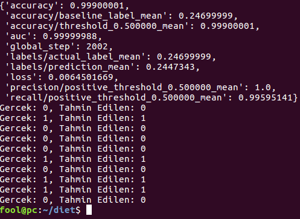

# DietAI
~~~
Yapayzaka sinir ağları ile beslenme koçu oluşturma.

Okuldaki yapayzeka dersi için hazırladığım bu araştırmada temel anlamda bir beslenme koçu
oluşturmaya çalıştım. Projede temel hedefim günlük aldığım ve harcadığım kalorilerin yapayzeka ile
hesabını yapıp kilo alıp almayacağımı öğrenmek.

Malesef veri toplama ve yapay sinir ağı modelini oluşturma kısmında bazı sıkıntılar çektim.
Bu araştırmamı -yetersiz olsa da- bu alanda Türkçe çok az kaynak bulunduğu için paylaşmak istedim.
Umarım benden sonrakilere öncü olur.
~~~
## Gerekli modüller
|Modül adı | Kullanım alanı
-----------|-----------------------
|tempfile | Geçici depolama
|pandas | Veri işleme
|tensorflow | Yapay sinir ağı
|matplotlib | Veri görselleştirme

## Kurulum
~~~
Öncelikle bu projeyi tensorflow yüklenmese dahi sanal ortamda çalıştırmanızı tavsiye ederim.
virtualenv env -p python3 komutu ile sanal ortamı oluşturup,
source env/bin/activate komutu ile sanal ortamı aktif edebilirsiniz.
pip3 install -r requirements.txt komutu ile gerekli modülleri kurabilirsiniz. 

Kütüphaneleri elle yüklemek isterseniz
  sudo apt-get install virtualenv - sanal ortam için
  sudo pip3 install tensorflow
  sudo pip3 install pandas
  sudo apt-get install python3-matplotlib

Eğer sorun çıkarsa modüllerin her birinin sitesinde detaylı kurulumları mevcut.
~~~

## Çalıştırma
~~~
jupyter-notebook DietAI.ipynb komutu ile bu dosyayı tarayıcı üstünde adım adım çalıştırabilirsiniz.
Daha çabuk sonuç almak istiyorsanız .py uzantılı dosyayı python3 ile çalıştırın.
~~~


```python
import tempfile
import pandas as pd
import tensorflow as tf
import matplotlib.pyplot as plt
import random
import datetime
%matplotlib inline
```

### Besin Verileri
~~~
Konumuz beslenme olduğu için haliyle besin verilerine ihtiyacımız var.
Aşağıda gördüğünüz ABBREV.csv dosyasında 92.000deb fazla besin kombinasyonunun detaylı bilgileri bulunmakta.
~~~


```python
food_data = pd.DataFrame.from_csv("ABBREV.csv")
food_data.tail()
```


<div>
<table border="1" class="dataframe">
  <thead>
    <tr style="text-align: right;">
      <th></th>
      <th>Shrt_Desc</th>
      <th>Water_(g)</th>
      <th>Energ_Kcal</th>
      <th>Protein_(g)</th>
      <th>Lipid_Tot_(g)</th>
      <th>Ash_(g)</th>
      <th>Carbohydrt_(g)</th>
      <th>Fiber_TD_(g)</th>
      <th>Sugar_Tot_(g)</th>
      <th>Calcium_(mg)</th>
      <th>...</th>
      <th>Vit_K_(µg)</th>
      <th>FA_Sat_(g)</th>
      <th>FA_Mono_(g)</th>
      <th>FA_Poly_(g)</th>
      <th>Cholestrl_(mg)</th>
      <th>GmWt_1</th>
      <th>GmWt_Desc1</th>
      <th>GmWt_2</th>
      <th>GmWt_Desc2</th>
      <th>Refuse_Pct</th>
    </tr>
    <tr>
      <th>No</th>
      <th></th>
      <th></th>
      <th></th>
      <th></th>
      <th></th>
      <th></th>
      <th></th>
      <th></th>
      <th></th>
      <th></th>
      <th></th>
      <th></th>
      <th></th>
      <th></th>
      <th></th>
      <th></th>
      <th></th>
      <th></th>
      <th></th>
      <th></th>
      <th></th>
    </tr>
  </thead>
  <tbody>
    <tr>
      <th>83110</th>
      <td>MACKEREL,SALTED</td>
      <td>43.00</td>
      <td>305</td>
      <td>18.50</td>
      <td>25.10</td>
      <td>13.40</td>
      <td>0.00</td>
      <td>0.0</td>
      <td>0.0</td>
      <td>66.0</td>
      <td>...</td>
      <td>7.8</td>
      <td>7.148</td>
      <td>8.320</td>
      <td>6.210</td>
      <td>95.0</td>
      <td>136.0</td>
      <td>1 cup, cooked</td>
      <td>NaN</td>
      <td>NaN</td>
      <td>0.0</td>
    </tr>
    <tr>
      <th>90240</th>
      <td>SCALLOP,(BAY&amp;SEA),CKD,STMD</td>
      <td>70.25</td>
      <td>111</td>
      <td>20.54</td>
      <td>0.84</td>
      <td>2.97</td>
      <td>5.41</td>
      <td>0.0</td>
      <td>0.0</td>
      <td>10.0</td>
      <td>...</td>
      <td>0.0</td>
      <td>0.218</td>
      <td>0.082</td>
      <td>0.222</td>
      <td>41.0</td>
      <td>85.0</td>
      <td>3 oz</td>
      <td>NaN</td>
      <td>NaN</td>
      <td>0.0</td>
    </tr>
    <tr>
      <th>90480</th>
      <td>SYRUP,CANE</td>
      <td>26.00</td>
      <td>269</td>
      <td>0.00</td>
      <td>0.00</td>
      <td>0.86</td>
      <td>73.14</td>
      <td>0.0</td>
      <td>73.2</td>
      <td>13.0</td>
      <td>...</td>
      <td>0.0</td>
      <td>0.000</td>
      <td>0.000</td>
      <td>0.000</td>
      <td>0.0</td>
      <td>NaN</td>
      <td>NaN</td>
      <td>NaN</td>
      <td>NaN</td>
      <td>0.0</td>
    </tr>
    <tr>
      <th>90560</th>
      <td>SNAIL,RAW</td>
      <td>79.20</td>
      <td>90</td>
      <td>16.10</td>
      <td>1.40</td>
      <td>1.30</td>
      <td>2.00</td>
      <td>0.0</td>
      <td>0.0</td>
      <td>10.0</td>
      <td>...</td>
      <td>0.1</td>
      <td>0.361</td>
      <td>0.259</td>
      <td>0.252</td>
      <td>50.0</td>
      <td>85.0</td>
      <td>3 oz</td>
      <td>NaN</td>
      <td>NaN</td>
      <td>0.0</td>
    </tr>
    <tr>
      <th>93600</th>
      <td>TURTLE,GREEN,RAW</td>
      <td>78.50</td>
      <td>89</td>
      <td>19.80</td>
      <td>0.50</td>
      <td>1.20</td>
      <td>0.00</td>
      <td>0.0</td>
      <td>0.0</td>
      <td>118.0</td>
      <td>...</td>
      <td>0.1</td>
      <td>0.127</td>
      <td>0.088</td>
      <td>0.170</td>
      <td>50.0</td>
      <td>85.0</td>
      <td>3 oz</td>
      <td>NaN</td>
      <td>NaN</td>
      <td>0.0</td>
    </tr>
  </tbody>
</table>
<p>5 rows × 52 columns</p>
</div>


~~~
Yapayzeka modelimizi eğitmek için kişilerin günlük aktiviteleri ile ilgili bilgilerine ihtiyacımız var.
Ben internette bulamadığım için kendi 'yapay' verilerimi oluşturdum.

Öncelikle beslenme alışkanlığını temsil etmek için 8 saat aralıkları ile 10.000 adet zaman verisini içeren
bir tablo oluşturdum. Bu tabloda yaş, kilo, boy, cinsiyet, günlük kalori ihtiyacı, günlük kalori alımı ve 
yakımı ile ilgili bilgiler tutulacak.

Modelle işimi kolaylaştırmak için tablodaki bazı kolonları sabit değerler olarak tanımladım.

~~~


```python
rng = pd.date_range(datetime.datetime.now(), periods=10000, freq='24H')
personal_data = pd.DataFrame(index=rng)
personal_data['age'] = 23
personal_data['weight'] = 75
personal_data['height'] = 176
personal_data['gender'] = "male"
```


```python
personal_data.head()
```


<div>
<table border="1" class="dataframe">
  <thead>
    <tr style="text-align: right;">
      <th></th>
      <th>age</th>
      <th>weight</th>
      <th>height</th>
      <th>gender</th>
    </tr>
  </thead>
  <tbody>
    <tr>
      <th>2016-12-29 01:39:20.228229</th>
      <td>23</td>
      <td>75</td>
      <td>176</td>
      <td>male</td>
    </tr>
    <tr>
      <th>2016-12-30 01:39:20.228229</th>
      <td>23</td>
      <td>75</td>
      <td>176</td>
      <td>male</td>
    </tr>
    <tr>
      <th>2016-12-31 01:39:20.228229</th>
      <td>23</td>
      <td>75</td>
      <td>176</td>
      <td>male</td>
    </tr>
    <tr>
      <th>2017-01-01 01:39:20.228229</th>
      <td>23</td>
      <td>75</td>
      <td>176</td>
      <td>male</td>
    </tr>
    <tr>
      <th>2017-01-02 01:39:20.228229</th>
      <td>23</td>
      <td>75</td>
      <td>176</td>
      <td>male</td>
    </tr>
  </tbody>
</table>
</div>


## Verilerin İşlenmesi
~~~
Besin tablosundan şimdilik işimize yarayacak olan 3 adet kolon var. 
Bunlar besin isimlerini içeren Shrt_Desc, kalori değerini içeren Energ_Kcal ve 
ölçüsünü belirten GmWt_1 kolonları.
~~~


```python
food_data = food_data[['Shrt_Desc', 'Energ_Kcal', 'GmWt_1']]
food_data.head()
```


<div>
<table border="1" class="dataframe">
  <thead>
    <tr style="text-align: right;">
      <th></th>
      <th>Shrt_Desc</th>
      <th>Energ_Kcal</th>
      <th>GmWt_1</th>
    </tr>
    <tr>
      <th>No</th>
      <th></th>
      <th></th>
      <th></th>
    </tr>
  </thead>
  <tbody>
    <tr>
      <th>1001</th>
      <td>BUTTER,WITH SALT</td>
      <td>717</td>
      <td>227.00</td>
    </tr>
    <tr>
      <th>1002</th>
      <td>BUTTER,WHIPPED,WITH SALT</td>
      <td>717</td>
      <td>151.00</td>
    </tr>
    <tr>
      <th>1003</th>
      <td>BUTTER OIL,ANHYDROUS</td>
      <td>876</td>
      <td>205.00</td>
    </tr>
    <tr>
      <th>1004</th>
      <td>CHEESE,BLUE</td>
      <td>353</td>
      <td>28.35</td>
    </tr>
    <tr>
      <th>1005</th>
      <td>CHEESE,BRICK</td>
      <td>371</td>
      <td>132.00</td>
    </tr>
  </tbody>
</table>
</div>


~~~
Günlük kalori ihtiyacını hesaplamak için Harris–Benedict formülünü kullanacağız.
Bu formül için cinsiyet, kilo, boy ve yaş değerlerine ihtiyacımız var.
Formül kadınlar ve erkekler için ağaşıdaki gibi
~~~
$$BMRman = (10 × weight) + (6.25 × height) - (5 × age) + 5$$
$$BMRwoman = (10 × weight) + (6.25 × height) - (5 × age) - 161$$

|Egzersiz Yoğunluğu|Günlük Kilokalori İhtiyacı
|----------------------------------------
|Çok az veya hiç|BMR x 1.2
|Hafif (haftada 1–3 gün)|BMR x 1.375
|Orta (haftada 3–5 gün)|BMR x 1.55
|Ağır(haftada 6–7 gün)|BMR x 1.725
|Çok Ağır (günde 2 kez, ekstra antreman)|BMR x 1.9
[Bu linkten](https://en.wikipedia.org/wiki/Harris%E2%80%93Benedict_equation) daha fazla bilgi edinebilirsiniz.


```python
activites = {"low":lambda x:x*1.2, 
             "light":lambda x:x*1.375, 
             "mid":lambda x:x*1.55, 
             "heavy":lambda x:x*1.725, 
             "very_heavy":lambda x:x*1.9}

def kcal(gender, weight, height, age, activity):
    """ Formüle göre BMR hesaplar ve aktiviteye göre günlük kcal değerini çıkartır"""
    if gender == "male":
        return  activites[activity]((10 * weight) + (6.25 * height) - (5 * age) + 5)
    else:
        return  activites[activity]((10 * weight) + (6.25 * height) - (5 * age) - 161)
```

~~~
Önce tabloya rastgele aktiviteler ekledik. Tablodaki her satıra erişip kcal fonksiyonuna gerekli parametreleri verdik.
Dönen değerlerden bir liste oluşturup bu listeyi kcal -günlük kkalori ihtiyacı- olarak tabloya ekledik
~~~


```python
personal_data['activity'] = [random.choice(list(activites.keys())) for x in range(len(personal_data))]
personal_data['kcal']=[kcal(person[1]['gender'], person[1]['weight'], person[1]['height'], person[1]['age'], person[1]['activity'])
            for person in personal_data.iterrows()]
personal_data.head()
```


<div>
<table border="1" class="dataframe">
  <thead>
    <tr style="text-align: right;">
      <th></th>
      <th>age</th>
      <th>weight</th>
      <th>height</th>
      <th>gender</th>
      <th>activity</th>
      <th>kcal</th>
    </tr>
  </thead>
  <tbody>
    <tr>
      <th>2016-12-29 01:39:20.228229</th>
      <td>23</td>
      <td>75</td>
      <td>176</td>
      <td>male</td>
      <td>mid</td>
      <td>2697.0</td>
    </tr>
    <tr>
      <th>2016-12-30 01:39:20.228229</th>
      <td>23</td>
      <td>75</td>
      <td>176</td>
      <td>male</td>
      <td>light</td>
      <td>2392.5</td>
    </tr>
    <tr>
      <th>2016-12-31 01:39:20.228229</th>
      <td>23</td>
      <td>75</td>
      <td>176</td>
      <td>male</td>
      <td>light</td>
      <td>2392.5</td>
    </tr>
    <tr>
      <th>2017-01-01 01:39:20.228229</th>
      <td>23</td>
      <td>75</td>
      <td>176</td>
      <td>male</td>
      <td>heavy</td>
      <td>3001.5</td>
    </tr>
    <tr>
      <th>2017-01-02 01:39:20.228229</th>
      <td>23</td>
      <td>75</td>
      <td>176</td>
      <td>male</td>
      <td>low</td>
      <td>2088.0</td>
    </tr>
  </tbody>
</table>
</div>


~~~
Eğitim verilerini oluşturmak için personal_data tablosundaki vatandaşa rastgele 3 öğün yemek yedireceğiz.
Yemek isimlerini ve kalori değerini de tabloya kolon olarak ekleyeceğiz. Bu işlem uzun sürebilir :)
~~~


```python
personal_data['breakfast'] = [random.choice(list(food_data['Shrt_Desc']))  for x in range(len(personal_data))]
breakfast_kcal = [food_data.loc[food_data['Shrt_Desc'] == x, 'Energ_Kcal'] for x in list(personal_data['breakfast'])]
personal_data['breakfast_kcal'] = [k.iloc[0] for k in breakfast_kcal]

personal_data['lunch'] = [random.choice(list(food_data['Shrt_Desc']))  for x in range(len(personal_data))]
lunch_kcal = [food_data.loc[food_data['Shrt_Desc'] == x, 'Energ_Kcal'] for x in list(personal_data['lunch'])]
personal_data['lunch_kcal'] = [k.iloc[0] for k in lunch_kcal]

personal_data['dinner'] = [random.choice(list(food_data['Shrt_Desc']))  for x in range(len(personal_data))]
dinner_kcal = [food_data.loc[food_data['Shrt_Desc'] == x, 'Energ_Kcal'] for x in list(personal_data['dinner'])]
personal_data['dinner_kcal'] = [k.iloc[0] for k in dinner_kcal]

personal_data['total_kcal'] = personal_data['dinner_kcal'] + personal_data['lunch_kcal'] + personal_data['breakfast_kcal']
```

~~~
Ardından yediklerini yakması için her gün rastgele 1 saat egzersiz yaptıracağız. Elimizdeki egzersiz tablosunda egzersiz isimleri ve kilo başına dakikada yaktırdığı kkalori oranı bulunuyor.
~~~
[Bu linkte](https://www.acefitness.org/updateable/update_display.aspx?pageID=593) detaylar mevcut.


```python
exercise_data = pd.read_csv("activity_costs.csv", sep=";")
exercise_data.head()
```


<div>
<table border="1" class="dataframe">
  <thead>
    <tr style="text-align: right;">
      <th></th>
      <th>Activity</th>
      <th>Energy_Expenditure</th>
    </tr>
  </thead>
  <tbody>
    <tr>
      <th>0</th>
      <td>Racquetball (recreational)</td>
      <td>0.07</td>
    </tr>
    <tr>
      <th>1</th>
      <td>Kayaking (leisure)</td>
      <td>0.04</td>
    </tr>
    <tr>
      <th>2</th>
      <td>Dancing (general)</td>
      <td>0.08</td>
    </tr>
    <tr>
      <th>3</th>
      <td>Golf (walking + bag)</td>
      <td>0.09</td>
    </tr>
    <tr>
      <th>4</th>
      <td>Running (5 mph, 12 min/mile)</td>
      <td>0.12</td>
    </tr>
  </tbody>
</table>
</div>


```python
personal_data['workout'] = [random.choice(list(exercise_data['Activity']))  for x in range(len(personal_data))]
excercise_kcal = [exercise_data.loc[exercise_data['Activity'] == x, 'Energy_Expenditure'] for x in list(personal_data['workout'])]
personal_data['workout_kcal'] = [k.iloc[0] for k in excercise_kcal]
personal_data['workout_kcal'] = personal_data['workout_kcal']*personal_data['weight']*60 # energy_exp * weight * min
personal_data.head()
```


<div>
<table border="1" class="dataframe">
  <thead>
    <tr style="text-align: right;">
      <th></th>
      <th>age</th>
      <th>weight</th>
      <th>height</th>
      <th>gender</th>
      <th>activity</th>
      <th>kcal</th>
      <th>breakfast</th>
      <th>breakfast_kcal</th>
      <th>lunch</th>
      <th>lunch_kcal</th>
      <th>dinner</th>
      <th>dinner_kcal</th>
      <th>total_kcal</th>
      <th>workout</th>
      <th>workout_kcal</th>
    </tr>
  </thead>
  <tbody>
    <tr>
      <th>2016-12-29 01:39:20.228229</th>
      <td>23</td>
      <td>75</td>
      <td>176</td>
      <td>male</td>
      <td>mid</td>
      <td>2697.0</td>
      <td>GAME MEAT,BISON,RIBEYE,LN,1" STEAK,CKD,BRLD</td>
      <td>177</td>
      <td>TENNIS BREAD,PLN (APACHE)</td>
      <td>258</td>
      <td>LAMB,NZ,IMP,FRZ,FORESHANK,LN&amp;FAT,RAW</td>
      <td>223</td>
      <td>658</td>
      <td>Standing (very light)</td>
      <td>180.0</td>
    </tr>
    <tr>
      <th>2016-12-30 01:39:20.228229</th>
      <td>23</td>
      <td>75</td>
      <td>176</td>
      <td>male</td>
      <td>light</td>
      <td>2392.5</td>
      <td>VEAL,VAR MEATS&amp;BY-PRODUCTS,SPLEEN,CKD,BRSD</td>
      <td>129</td>
      <td>SILK PLN SOY YOGURT</td>
      <td>66</td>
      <td>WENDY'S,CHICK NUGGETS</td>
      <td>326</td>
      <td>521</td>
      <td>Sitting Activities (very light)</td>
      <td>135.0</td>
    </tr>
    <tr>
      <th>2016-12-31 01:39:20.228229</th>
      <td>23</td>
      <td>75</td>
      <td>176</td>
      <td>male</td>
      <td>light</td>
      <td>2392.5</td>
      <td>FORM BAR,MARS SNACK US,SNICKERS MARATHON ENERG...</td>
      <td>386</td>
      <td>BEE,ASTRLN,WGYU,RB,SML END RB STK/RST,BLS,LN,M...</td>
      <td>234</td>
      <td>GAME MEAT,BEEFALO,COMP OF CUTS,RAW</td>
      <td>143</td>
      <td>763</td>
      <td>Walking (4 mph 15 min/mile)</td>
      <td>360.0</td>
    </tr>
    <tr>
      <th>2017-01-01 01:39:20.228229</th>
      <td>23</td>
      <td>75</td>
      <td>176</td>
      <td>male</td>
      <td>heavy</td>
      <td>3001.5</td>
      <td>CASHEW NUTS,DRY RSTD,WO/SALT</td>
      <td>574</td>
      <td>LAMB,DOM,FORESHANK,LN&amp;FAT,1/8"FAT,CKD,BRSD</td>
      <td>243</td>
      <td>LEMON GRASS (CITRONELLA),RAW</td>
      <td>99</td>
      <td>916</td>
      <td>Mowing Lawn (walking, power)</td>
      <td>360.0</td>
    </tr>
    <tr>
      <th>2017-01-02 01:39:20.228229</th>
      <td>23</td>
      <td>75</td>
      <td>176</td>
      <td>male</td>
      <td>low</td>
      <td>2088.0</td>
      <td>JACKSON'S,OLD FASHIONED LEMON JUMBLE COOKIES</td>
      <td>469</td>
      <td>SALMON,SOCKEYE,CND,DRND SOL,WO/ SKN &amp; BONES</td>
      <td>158</td>
      <td>VEAL,VAR MEATS&amp;BY-PRODUCTS,LUNGS,CKD,BRSD</td>
      <td>104</td>
      <td>731</td>
      <td>Walking (4 mph 15 min/mile)</td>
      <td>360.0</td>
    </tr>
  </tbody>
</table>
</div>


~~~
Tabloya gerekli tüm verileri ekledik şimdi egzersizde harcanan enerjinin öğünlerden alınanlardan fazla olanları 1 olarak etiketleyeceğiz. Böylece yapay sinir ağı için eğitim datasetini hazırlamış olacağız.
~~~


```python
def calibrate_labels(data_frame):
    """ calculates intake and cost value diff and adds it as label to dataframe """
    data_frame['label'] = data_frame[['total_kcal', 'workout_kcal']].apply(lambda x: x['workout_kcal'] - x['total_kcal'] > 0, axis=1).astype(int)
    return data_frame
```


```python
personal_data = calibrate_labels(personal_data)
personal_data.to_csv("my_data.csv")
personal_data.head()
```


<div>
<table border="1" class="dataframe">
  <thead>
    <tr style="text-align: right;">
      <th></th>
      <th>age</th>
      <th>weight</th>
      <th>height</th>
      <th>gender</th>
      <th>activity</th>
      <th>kcal</th>
      <th>breakfast</th>
      <th>breakfast_kcal</th>
      <th>lunch</th>
      <th>lunch_kcal</th>
      <th>dinner</th>
      <th>dinner_kcal</th>
      <th>total_kcal</th>
      <th>workout</th>
      <th>workout_kcal</th>
      <th>label</th>
    </tr>
  </thead>
  <tbody>
    <tr>
      <th>2016-12-29 01:39:20.228229</th>
      <td>23</td>
      <td>75</td>
      <td>176</td>
      <td>male</td>
      <td>mid</td>
      <td>2697.0</td>
      <td>GAME MEAT,BISON,RIBEYE,LN,1" STEAK,CKD,BRLD</td>
      <td>177</td>
      <td>TENNIS BREAD,PLN (APACHE)</td>
      <td>258</td>
      <td>LAMB,NZ,IMP,FRZ,FORESHANK,LN&amp;FAT,RAW</td>
      <td>223</td>
      <td>658</td>
      <td>Standing (very light)</td>
      <td>180.0</td>
      <td>0</td>
    </tr>
    <tr>
      <th>2016-12-30 01:39:20.228229</th>
      <td>23</td>
      <td>75</td>
      <td>176</td>
      <td>male</td>
      <td>light</td>
      <td>2392.5</td>
      <td>VEAL,VAR MEATS&amp;BY-PRODUCTS,SPLEEN,CKD,BRSD</td>
      <td>129</td>
      <td>SILK PLN SOY YOGURT</td>
      <td>66</td>
      <td>WENDY'S,CHICK NUGGETS</td>
      <td>326</td>
      <td>521</td>
      <td>Sitting Activities (very light)</td>
      <td>135.0</td>
      <td>0</td>
    </tr>
    <tr>
      <th>2016-12-31 01:39:20.228229</th>
      <td>23</td>
      <td>75</td>
      <td>176</td>
      <td>male</td>
      <td>light</td>
      <td>2392.5</td>
      <td>FORM BAR,MARS SNACK US,SNICKERS MARATHON ENERG...</td>
      <td>386</td>
      <td>BEE,ASTRLN,WGYU,RB,SML END RB STK/RST,BLS,LN,M...</td>
      <td>234</td>
      <td>GAME MEAT,BEEFALO,COMP OF CUTS,RAW</td>
      <td>143</td>
      <td>763</td>
      <td>Walking (4 mph 15 min/mile)</td>
      <td>360.0</td>
      <td>0</td>
    </tr>
    <tr>
      <th>2017-01-01 01:39:20.228229</th>
      <td>23</td>
      <td>75</td>
      <td>176</td>
      <td>male</td>
      <td>heavy</td>
      <td>3001.5</td>
      <td>CASHEW NUTS,DRY RSTD,WO/SALT</td>
      <td>574</td>
      <td>LAMB,DOM,FORESHANK,LN&amp;FAT,1/8"FAT,CKD,BRSD</td>
      <td>243</td>
      <td>LEMON GRASS (CITRONELLA),RAW</td>
      <td>99</td>
      <td>916</td>
      <td>Mowing Lawn (walking, power)</td>
      <td>360.0</td>
      <td>0</td>
    </tr>
    <tr>
      <th>2017-01-02 01:39:20.228229</th>
      <td>23</td>
      <td>75</td>
      <td>176</td>
      <td>male</td>
      <td>low</td>
      <td>2088.0</td>
      <td>JACKSON'S,OLD FASHIONED LEMON JUMBLE COOKIES</td>
      <td>469</td>
      <td>SALMON,SOCKEYE,CND,DRND SOL,WO/ SKN &amp; BONES</td>
      <td>158</td>
      <td>VEAL,VAR MEATS&amp;BY-PRODUCTS,LUNGS,CKD,BRSD</td>
      <td>104</td>
      <td>731</td>
      <td>Walking (4 mph 15 min/mile)</td>
      <td>360.0</td>
      <td>0</td>
    </tr>
  </tbody>
</table>
</div>


```python
personal_data.columns
```


    Index(['age', 'weight', 'height', 'gender', 'activity', 'kcal', 'breakfast',
           'breakfast_kcal', 'lunch', 'lunch_kcal', 'dinner', 'dinner_kcal',
           'total_kcal', 'workout', 'workout_kcal', 'label'],
          dtype='object')


~~~
Opsiyonel olarak tablodaki ilk n veriyi test verisi olarak kaydettik. 
İlerde bu programı tekrar çalıştırdığımızda veriler rastgele atanacağı için eski test verileri 
bizim için tutarlı ama farklı değerler olmuş olacak.
~~~
# !!! Bu hücre code türünde olmayabilir !!!
personal_test = personal_data[:1000] # created already
personal_test.to_csv("my_test.csv")
personal_test.head()
## Verileri Görselleştirelim
~~~
Günlük alınan ve harcanan kcal miktarı.
~~~


```python
personal_data[['total_kcal', 'workout_kcal']][:20].plot(color=["r", "b"], figsize=(15, 4), fontsize=10, alpha=0.5)
```


    <matplotlib.axes._subplots.AxesSubplot at 0x7f50ba8b0eb8>


~~~
1. Pastada alınan ve verilen kilo oranlarını,
2. Pastada günlük kalori ihtiyaç türlerinin oranlarını çizdirdik.
~~~


```python
personal_data['label'].value_counts().plot.pie(autopct="%.2f", colors=("cyan", "lightgreen"), figsize=(5, 5));
plt.figure();
personal_data['activity'].value_counts().plot.pie(autopct="%.2f", colors=("cyan", "lightgreen", "pink", "yellow", "lightblue"), figsize=(5, 5));
```


~~~
Öğünlerde alınan kkalorilerin kümülatif toplamı (tüm değerler sırayla toplanır).
~~~


```python
personal_data[['breakfast_kcal', 'lunch_kcal', 'dinner_kcal', 'total_kcal']].cumsum().plot.area(figsize=(10,5), alpha=0.5)
```


    <matplotlib.axes._subplots.AxesSubplot at 0x7f50b6f43ba8>


# Yapay Sinir Ağı

~~~
Bu örnekte wide and deep learning tekniğini kullandık. 
Basitçe açıklamak gerekirse 'wide' olarak belirlediğimiz kısım ezberleme (Linear Classification),
'deep' olarak belirlediğimiz katmanlı sinir ağı ile sınıflandırma yapacağız.

Wide and deep learning tekniği büyük ölçekli regresyonlar (veriler arasındaki ilişkinin analizi) ve sparse (çok sayıda olası değerlerin bulunduğu veya kategorinin çok sayıda parçaya bölündüğü) sınıflandırma problemlerinde etkili.
~~~
[Burada](https://research.googleblog.com/2016/06/wide-deep-learning-better-together-with.html) wide & deep learning ile ilgili güzel bir blog yazısı var.
[Burada](https://www.tensorflow.org/tutorials/wide_and_deep/) da tensorflowun kendi örneği var.


~~~
Aşağıda sürekli ve kategorisel kolonları ve model için gerekli bazı değişkenleri belirledik.
~~~
### Sürekli
    * age
    * weight
    * height
    * kcal
    * breakfast_kcal
    * lunch_kcal
    * dinner_kcal
    * total_kcal
    * workout_kcal
    
### Kategorsel
    * gender
    * activity
    * breakfast
    * lunch
    * dinner
    * workout


```python
flags = tf.app.flags
FLAGS = flags.FLAGS

flags.DEFINE_string("model_dir", "", "Base directory for output models.")
flags.DEFINE_string("model_type", "wide_n_deep",
                    "Valid model types: {'wide', 'deep', 'wide_n_deep'}.")
flags.DEFINE_string(
    "train_data",
    "",
    "Path to the training data.")
flags.DEFINE_string(
    "test_data",
    "",
    "Path to the test data.")

COLUMNS = ['age', 'weight', 'height', 'gender', 'activity', 'kcal', 'breakfast',
       'breakfast_kcal', 'lunch', 'lunch_kcal', 'dinner', 'dinner_kcal',
       'total_kcal', 'workout', 'workout_kcal', 'label']
LABEL_COLUMN = "label"
CONTINUOUS_COLUMNS =  ['age', 'weight', 'height', 'kcal', 'breakfast_kcal', 'lunch_kcal', 'dinner_kcal', 'total_kcal', 'workout_kcal']
CATEGORICAL_COLUMNS= ["gender", 'activity', 'breakfast', 'lunch', 'dinner', 'workout']
```


```python
def build_estimator(model_dir):
    """ Yapay sinir aği modeli."""
    # Sparse temel kolon
    gender = tf.contrib.layers.sparse_column_with_keys(column_name="gender",
                                                     keys=["female", "male"])
    
    # Surekli
    age = tf.contrib.layers.real_valued_column("age")
    weight = tf.contrib.layers.real_valued_column("weight")
    height = tf.contrib.layers.real_valued_column("height")
    kcal = tf.contrib.layers.real_valued_column("kcal")
    breakfast_kcal = tf.contrib.layers.real_valued_column("breakfast_kcal")
    lunch_kcal = tf.contrib.layers.real_valued_column("lunch_kcal")
    dinner_kcal = tf.contrib.layers.real_valued_column("dinner_kcal")
    total_kcal = tf.contrib.layers.real_valued_column("total_kcal")
    workout_kcal = tf.contrib.layers.real_valued_column("workout_kcal")

    # Kategorisel
    age_buckets = tf.contrib.layers.bucketized_column(age, boundaries=[
                                                        18, 25, 30, 35, 40, 45,
                                                        50, 55, 60, 65])
    
    activity = tf.contrib.layers.sparse_column_with_hash_bucket(
      "activity", hash_bucket_size=5)
    # öğünlerin türü belirlenebilirse hash_bucket_size daha tutarlı tanımlanabilir.
    breakfast = tf.contrib.layers.sparse_column_with_hash_bucket(
      "breakfast", hash_bucket_size=1000)
    lunch = tf.contrib.layers.sparse_column_with_hash_bucket(
      "lunch", hash_bucket_size=1000)
    dinner = tf.contrib.layers.sparse_column_with_hash_bucket(
      "dinner", hash_bucket_size=1000)
    
    workout = tf.contrib.layers.sparse_column_with_hash_bucket(
      "workout", hash_bucket_size=60) # 60 farklı egzersizimiz var
    
    # Wide columns and deep columns.
    wide_columns = [gender, age_buckets, activity, breakfast, lunch, dinner, workout]
    
    
    deep_columns = [
        tf.contrib.layers.embedding_column(gender, dimension=8),
        age,
        weight,
        height,
        kcal,
        breakfast_kcal,
        lunch_kcal,
        dinner_kcal,
        total_kcal,
        workout_kcal
    ]

    if FLAGS.model_type == "wide":
        m = tf.contrib.learn.LinearClassifier(model_dir=model_dir,
                                          feature_columns=wide_columns)
    elif FLAGS.model_type == "deep":
        m = tf.contrib.learn.DNNClassifier(
            model_dir=model_dir,
            feature_columns=deep_columns,
            hidden_units=[200, 100],  # gizli katma ve tensor sayısı
            optimizer=tflearn.optimizers.SGD(learning_rate=0.001), # Adam, SGD, RMSprop, RMSprop, Ftrl, AdaGrad 
            )
    else:
        m = tf.contrib.learn.DNNLinearCombinedClassifier(
            model_dir=model_dir,
            linear_feature_columns=wide_columns,
            dnn_feature_columns=deep_columns,
            dnn_hidden_units=[100, 50])
    return m
```


```python
def input_fn(df):
    """ Kolonları tensorflow sabitlerine dönüştürür ve birleştirir. """
   
    continuous_cols = {k: tf.constant(df[k].values) for k in CONTINUOUS_COLUMNS}
    
    categorical_cols = {k: tf.SparseTensor(
        indices=[[i, 0] for i in range(df[k].size)],
        values=df[k].values,
        shape=[df[k].size, 1])
                      for k in CATEGORICAL_COLUMNS}
    
    feature_cols = dict(continuous_cols)
    feature_cols.update(categorical_cols)
    label = tf.constant(df[LABEL_COLUMN].values)

    return feature_cols, label
```

~~~
Geçici bir klasor içinde modeli oluşturduk.
~~~


```python
model_dir = tempfile.mkdtemp()
m = build_estimator(model_dir) 
```

    WARNING:tensorflow:The default value of combiner will change from "sum" to "sqrtn" after 2016/11/01.
    WARNING:tensorflow:The default value of combiner will change from "sum" to "sqrtn" after 2016/11/01.
    WARNING:tensorflow:The default value of combiner will change from "sum" to "sqrtn" after 2016/11/01.
    WARNING:tensorflow:The default value of combiner will change from "sum" to "sqrtn" after 2016/11/01.
    WARNING:tensorflow:The default value of combiner will change from "sum" to "sqrtn" after 2016/11/01.
    WARNING:tensorflow:The default value of combiner will change from "sum" to "sqrtn" after 2016/11/01.
    WARNING:tensorflow:The default value of combiner will change from "mean" to "sqrtn" after 2016/11/01.
    INFO:tensorflow:Using default config.
    INFO:tensorflow:Using config: {'keep_checkpoint_max': 5, '_num_ps_replicas': 0, '_task_type': None, 'keep_checkpoint_every_n_hours': 10000, 'save_checkpoints_secs': 600, '_task_id': 0, 'save_summary_steps': 100, '_is_chief': True, '_cluster_spec': <tensorflow.python.training.server_lib.ClusterSpec object at 0x7f50b6cef208>, 'save_checkpoints_steps': None, 'tf_config': gpu_options {
      per_process_gpu_memory_fraction: 1
    }
    , '_evaluation_master': '', '_master': '', '_environment': 'local', 'tf_random_seed': None}


~~~
Hazırladığımız tabloyu input_fn fonksiyonu ile tensorflow için hazır hale getirdik ve modelimize
verdik. 2. parametre olarak modeli eğitme işleminin kaç kez gerçekleştirileceğini belirledik.
~~~


```python
train_res = m.fit(input_fn=lambda: input_fn(personal_data), steps=2000)
```

    WARNING:tensorflow:From /usr/local/lib/python3.5/dist-packages/tensorflow/contrib/learn/python/learn/estimators/dnn_linear_combined.py:711 in fit.: calling BaseEstimator.fit (from tensorflow.contrib.learn.python.learn.estimators.estimator) with x is deprecated and will be removed after 2016-12-01.
    Instructions for updating:
    Estimator is decoupled from Scikit Learn interface by moving into
    separate class SKCompat. Arguments x, y and batch_size are only
    available in the SKCompat class, Estimator will only accept input_fn.
    Example conversion:
      est = Estimator(...) -> est = SKCompat(Estimator(...))
    WARNING:tensorflow:From /usr/local/lib/python3.5/dist-packages/tensorflow/contrib/learn/python/learn/estimators/dnn_linear_combined.py:711 in fit.: calling BaseEstimator.fit (from tensorflow.contrib.learn.python.learn.estimators.estimator) with y is deprecated and will be removed after 2016-12-01.
    Instructions for updating:
    Estimator is decoupled from Scikit Learn interface by moving into
    separate class SKCompat. Arguments x, y and batch_size are only
    available in the SKCompat class, Estimator will only accept input_fn.
    Example conversion:
      est = Estimator(...) -> est = SKCompat(Estimator(...))
    WARNING:tensorflow:From /usr/local/lib/python3.5/dist-packages/tensorflow/contrib/learn/python/learn/estimators/dnn_linear_combined.py:711 in fit.: calling BaseEstimator.fit (from tensorflow.contrib.learn.python.learn.estimators.estimator) with batch_size is deprecated and will be removed after 2016-12-01.
    Instructions for updating:
    Estimator is decoupled from Scikit Learn interface by moving into
    separate class SKCompat. Arguments x, y and batch_size are only
    available in the SKCompat class, Estimator will only accept input_fn.
    Example conversion:
      est = Estimator(...) -> est = SKCompat(Estimator(...))
    WARNING:tensorflow:Rank of input Tensor (1) should be the same as output_rank (2) for column. Will attempt to expand dims. It is highly recommended that you resize your input, as this behavior may change.
    WARNING:tensorflow:Rank of input Tensor (1) should be the same as output_rank (2) for column. Will attempt to expand dims. It is highly recommended that you resize your input, as this behavior may change.
    WARNING:tensorflow:Rank of input Tensor (1) should be the same as output_rank (2) for column. Will attempt to expand dims. It is highly recommended that you resize your input, as this behavior may change.
    WARNING:tensorflow:Rank of input Tensor (1) should be the same as output_rank (2) for column. Will attempt to expand dims. It is highly recommended that you resize your input, as this behavior may change.
    WARNING:tensorflow:Rank of input Tensor (1) should be the same as output_rank (2) for column. Will attempt to expand dims. It is highly recommended that you resize your input, as this behavior may change.
    WARNING:tensorflow:Rank of input Tensor (1) should be the same as output_rank (2) for column. Will attempt to expand dims. It is highly recommended that you resize your input, as this behavior may change.
    WARNING:tensorflow:Rank of input Tensor (1) should be the same as output_rank (2) for column. Will attempt to expand dims. It is highly recommended that you resize your input, as this behavior may change.
    WARNING:tensorflow:Rank of input Tensor (1) should be the same as output_rank (2) for column. Will attempt to expand dims. It is highly recommended that you resize your input, as this behavior may change.
    WARNING:tensorflow:Rank of input Tensor (1) should be the same as output_rank (2) for column. Will attempt to expand dims. It is highly recommended that you resize your input, as this behavior may change.
    WARNING:tensorflow:From /usr/local/lib/python3.5/dist-packages/tensorflow/contrib/learn/python/learn/estimators/dnn_linear_combined.py:364 in _add_hidden_layer_summary.: scalar_summary (from tensorflow.python.ops.logging_ops) is deprecated and will be removed after 2016-11-30.
    Instructions for updating:
    Please switch to tf.summary.scalar. Note that tf.summary.scalar uses the node name instead of the tag. This means that TensorFlow will automatically de-duplicate summary names based on the scope they are created in. Also, passing a tensor or list of tags to a scalar summary op is no longer supported.
    WARNING:tensorflow:From /usr/local/lib/python3.5/dist-packages/tensorflow/contrib/learn/python/learn/estimators/dnn_linear_combined.py:365 in _add_hidden_layer_summary.: histogram_summary (from tensorflow.python.ops.logging_ops) is deprecated and will be removed after 2016-11-30.
    Instructions for updating:
    Please switch to tf.summary.histogram. Note that tf.summary.histogram uses the node name instead of the tag. This means that TensorFlow will automatically de-duplicate summary names based on their scope.
    WARNING:tensorflow:From /usr/local/lib/python3.5/dist-packages/tensorflow/contrib/learn/python/learn/estimators/dnn_linear_combined.py:364 in _add_hidden_layer_summary.: scalar_summary (from tensorflow.python.ops.logging_ops) is deprecated and will be removed after 2016-11-30.
    Instructions for updating:
    Please switch to tf.summary.scalar. Note that tf.summary.scalar uses the node name instead of the tag. This means that TensorFlow will automatically de-duplicate summary names based on the scope they are created in. Also, passing a tensor or list of tags to a scalar summary op is no longer supported.
    WARNING:tensorflow:From /usr/local/lib/python3.5/dist-packages/tensorflow/contrib/learn/python/learn/estimators/dnn_linear_combined.py:365 in _add_hidden_layer_summary.: histogram_summary (from tensorflow.python.ops.logging_ops) is deprecated and will be removed after 2016-11-30.
    Instructions for updating:
    Please switch to tf.summary.histogram. Note that tf.summary.histogram uses the node name instead of the tag. This means that TensorFlow will automatically de-duplicate summary names based on their scope.
    WARNING:tensorflow:From /usr/local/lib/python3.5/dist-packages/tensorflow/contrib/learn/python/learn/estimators/dnn_linear_combined.py:364 in _add_hidden_layer_summary.: scalar_summary (from tensorflow.python.ops.logging_ops) is deprecated and will be removed after 2016-11-30.
    Instructions for updating:
    Please switch to tf.summary.scalar. Note that tf.summary.scalar uses the node name instead of the tag. This means that TensorFlow will automatically de-duplicate summary names based on the scope they are created in. Also, passing a tensor or list of tags to a scalar summary op is no longer supported.
    WARNING:tensorflow:From /usr/local/lib/python3.5/dist-packages/tensorflow/contrib/learn/python/learn/estimators/dnn_linear_combined.py:365 in _add_hidden_layer_summary.: histogram_summary (from tensorflow.python.ops.logging_ops) is deprecated and will be removed after 2016-11-30.
    Instructions for updating:
    Please switch to tf.summary.histogram. Note that tf.summary.histogram uses the node name instead of the tag. This means that TensorFlow will automatically de-duplicate summary names based on their scope.
    INFO:tensorflow:Create CheckpointSaverHook.
    INFO:tensorflow:loss = 57.8989, step = 2
    INFO:tensorflow:Saving checkpoints for 2 into /tmp/tmpuyguwpq8/model.ckpt.
    WARNING:tensorflow:*******************************************************
    WARNING:tensorflow:TensorFlow's V1 checkpoint format has been deprecated.
    WARNING:tensorflow:Consider switching to the more efficient V2 format:
    WARNING:tensorflow:   `tf.train.Saver(write_version=tf.train.SaverDef.V2)`
    WARNING:tensorflow:now on by default.
    WARNING:tensorflow:*******************************************************
    INFO:tensorflow:global_step/sec: 6.64743
    INFO:tensorflow:loss = 0.126272, step = 202
    INFO:tensorflow:global_step/sec: 8.99129
    INFO:tensorflow:global_step/sec: 9.86619
    INFO:tensorflow:loss = 0.0281914, step = 402
    INFO:tensorflow:global_step/sec: 9.58863
    INFO:tensorflow:global_step/sec: 8.66416
    INFO:tensorflow:loss = 0.0123712, step = 602
    INFO:tensorflow:global_step/sec: 8.06169
    INFO:tensorflow:global_step/sec: 7.74497
    INFO:tensorflow:loss = 0.0105676, step = 802
    INFO:tensorflow:global_step/sec: 7.13404
    INFO:tensorflow:global_step/sec: 8.05061
    INFO:tensorflow:loss = 0.00963363, step = 1002
    INFO:tensorflow:global_step/sec: 8.87526
    INFO:tensorflow:Saving checkpoints for 1002 into /tmp/tmpuyguwpq8/model.ckpt.
    WARNING:tensorflow:*******************************************************
    WARNING:tensorflow:TensorFlow's V1 checkpoint format has been deprecated.
    WARNING:tensorflow:Consider switching to the more efficient V2 format:
    WARNING:tensorflow:   `tf.train.Saver(write_version=tf.train.SaverDef.V2)`
    WARNING:tensorflow:now on by default.
    WARNING:tensorflow:*******************************************************
    INFO:tensorflow:Loss for final step: 0.00963363.


~~~
Önceden kaydettiğimiz test dosyasını (personal_data'ın bir parçası da olabilir) modelimize verdik
ve yine tekrar sayısını belirledik.
~~~


```python
personal_test = pd.read_csv("my_test.csv")
```


```python
results = m.evaluate(input_fn=lambda: input_fn(personal_test), steps=1000)
```

    WARNING:tensorflow:From /usr/local/lib/python3.5/dist-packages/tensorflow/contrib/learn/python/learn/estimators/dnn_linear_combined.py:719 in evaluate.: calling BaseEstimator.evaluate (from tensorflow.contrib.learn.python.learn.estimators.estimator) with x is deprecated and will be removed after 2016-12-01.
    Instructions for updating:
    Estimator is decoupled from Scikit Learn interface by moving into
    separate class SKCompat. Arguments x, y and batch_size are only
    available in the SKCompat class, Estimator will only accept input_fn.
    Example conversion:
      est = Estimator(...) -> est = SKCompat(Estimator(...))
    WARNING:tensorflow:From /usr/local/lib/python3.5/dist-packages/tensorflow/contrib/learn/python/learn/estimators/dnn_linear_combined.py:719 in evaluate.: calling BaseEstimator.evaluate (from tensorflow.contrib.learn.python.learn.estimators.estimator) with y is deprecated and will be removed after 2016-12-01.
    Instructions for updating:
    Estimator is decoupled from Scikit Learn interface by moving into
    separate class SKCompat. Arguments x, y and batch_size are only
    available in the SKCompat class, Estimator will only accept input_fn.
    Example conversion:
      est = Estimator(...) -> est = SKCompat(Estimator(...))
    WARNING:tensorflow:From /usr/local/lib/python3.5/dist-packages/tensorflow/contrib/learn/python/learn/estimators/dnn_linear_combined.py:719 in evaluate.: calling BaseEstimator.evaluate (from tensorflow.contrib.learn.python.learn.estimators.estimator) with batch_size is deprecated and will be removed after 2016-12-01.
    Instructions for updating:
    Estimator is decoupled from Scikit Learn interface by moving into
    separate class SKCompat. Arguments x, y and batch_size are only
    available in the SKCompat class, Estimator will only accept input_fn.
    Example conversion:
      est = Estimator(...) -> est = SKCompat(Estimator(...))
    WARNING:tensorflow:Rank of input Tensor (1) should be the same as output_rank (2) for column. Will attempt to expand dims. It is highly recommended that you resize your input, as this behavior may change.
    WARNING:tensorflow:Rank of input Tensor (1) should be the same as output_rank (2) for column. Will attempt to expand dims. It is highly recommended that you resize your input, as this behavior may change.
    WARNING:tensorflow:Rank of input Tensor (1) should be the same as output_rank (2) for column. Will attempt to expand dims. It is highly recommended that you resize your input, as this behavior may change.
    WARNING:tensorflow:Rank of input Tensor (1) should be the same as output_rank (2) for column. Will attempt to expand dims. It is highly recommended that you resize your input, as this behavior may change.
    WARNING:tensorflow:Rank of input Tensor (1) should be the same as output_rank (2) for column. Will attempt to expand dims. It is highly recommended that you resize your input, as this behavior may change.
    WARNING:tensorflow:Rank of input Tensor (1) should be the same as output_rank (2) for column. Will attempt to expand dims. It is highly recommended that you resize your input, as this behavior may change.
    WARNING:tensorflow:Rank of input Tensor (1) should be the same as output_rank (2) for column. Will attempt to expand dims. It is highly recommended that you resize your input, as this behavior may change.
    WARNING:tensorflow:Rank of input Tensor (1) should be the same as output_rank (2) for column. Will attempt to expand dims. It is highly recommended that you resize your input, as this behavior may change.
    WARNING:tensorflow:Rank of input Tensor (1) should be the same as output_rank (2) for column. Will attempt to expand dims. It is highly recommended that you resize your input, as this behavior may change.
    WARNING:tensorflow:From /usr/local/lib/python3.5/dist-packages/tensorflow/contrib/learn/python/learn/estimators/dnn_linear_combined.py:364 in _add_hidden_layer_summary.: scalar_summary (from tensorflow.python.ops.logging_ops) is deprecated and will be removed after 2016-11-30.
    Instructions for updating:
    Please switch to tf.summary.scalar. Note that tf.summary.scalar uses the node name instead of the tag. This means that TensorFlow will automatically de-duplicate summary names based on the scope they are created in. Also, passing a tensor or list of tags to a scalar summary op is no longer supported.
    WARNING:tensorflow:From /usr/local/lib/python3.5/dist-packages/tensorflow/contrib/learn/python/learn/estimators/dnn_linear_combined.py:365 in _add_hidden_layer_summary.: histogram_summary (from tensorflow.python.ops.logging_ops) is deprecated and will be removed after 2016-11-30.
    Instructions for updating:
    Please switch to tf.summary.histogram. Note that tf.summary.histogram uses the node name instead of the tag. This means that TensorFlow will automatically de-duplicate summary names based on their scope.
    WARNING:tensorflow:From /usr/local/lib/python3.5/dist-packages/tensorflow/contrib/learn/python/learn/estimators/dnn_linear_combined.py:364 in _add_hidden_layer_summary.: scalar_summary (from tensorflow.python.ops.logging_ops) is deprecated and will be removed after 2016-11-30.
    Instructions for updating:
    Please switch to tf.summary.scalar. Note that tf.summary.scalar uses the node name instead of the tag. This means that TensorFlow will automatically de-duplicate summary names based on the scope they are created in. Also, passing a tensor or list of tags to a scalar summary op is no longer supported.
    WARNING:tensorflow:From /usr/local/lib/python3.5/dist-packages/tensorflow/contrib/learn/python/learn/estimators/dnn_linear_combined.py:365 in _add_hidden_layer_summary.: histogram_summary (from tensorflow.python.ops.logging_ops) is deprecated and will be removed after 2016-11-30.
    Instructions for updating:
    Please switch to tf.summary.histogram. Note that tf.summary.histogram uses the node name instead of the tag. This means that TensorFlow will automatically de-duplicate summary names based on their scope.
    WARNING:tensorflow:From /usr/local/lib/python3.5/dist-packages/tensorflow/contrib/learn/python/learn/estimators/dnn_linear_combined.py:364 in _add_hidden_layer_summary.: scalar_summary (from tensorflow.python.ops.logging_ops) is deprecated and will be removed after 2016-11-30.
    Instructions for updating:
    Please switch to tf.summary.scalar. Note that tf.summary.scalar uses the node name instead of the tag. This means that TensorFlow will automatically de-duplicate summary names based on the scope they are created in. Also, passing a tensor or list of tags to a scalar summary op is no longer supported.
    WARNING:tensorflow:From /usr/local/lib/python3.5/dist-packages/tensorflow/contrib/learn/python/learn/estimators/dnn_linear_combined.py:365 in _add_hidden_layer_summary.: histogram_summary (from tensorflow.python.ops.logging_ops) is deprecated and will be removed after 2016-11-30.
    Instructions for updating:
    Please switch to tf.summary.histogram. Note that tf.summary.histogram uses the node name instead of the tag. This means that TensorFlow will automatically de-duplicate summary names based on their scope.


    ---------------------------------------------------------------------------

    KeyboardInterrupt                         Traceback (most recent call last)

    <ipython-input-25-6bea659d15f1> in <module>()
    ----> 1 results = m.evaluate(input_fn=lambda: input_fn(personal_test), steps=1000)
    

    /usr/local/lib/python3.5/dist-packages/tensorflow/contrib/learn/python/learn/estimators/dnn_linear_combined.py in evaluate(self, x, y, input_fn, feed_fn, batch_size, steps, metrics, name)
        717     return self._estimator.evaluate(
        718         x=x, y=y, input_fn=input_fn, feed_fn=feed_fn, batch_size=batch_size,
    --> 719         steps=steps, metrics=metrics, name=name)
        720 
        721   @deprecated_arg_values(


    /usr/local/lib/python3.5/dist-packages/tensorflow/python/util/deprecation.py in new_func(*args, **kwargs)
        189             _call_location(), decorator_utils.get_qualified_name(func),
        190             func.__module__, arg_name, date, instructions)
    --> 191       return func(*args, **kwargs)
        192     new_func.__doc__ = _add_deprecated_arg_notice_to_docstring(
        193         func.__doc__, date, instructions)


    /usr/local/lib/python3.5/dist-packages/tensorflow/contrib/learn/python/learn/estimators/estimator.py in evaluate(self, x, y, input_fn, feed_fn, batch_size, steps, metrics, name)
        425                                                      steps=steps,
        426                                                      metrics=metrics,
    --> 427                                                      name=name)
        428     if eval_results is not None:
        429       eval_results.update({'global_step': global_step})


    /usr/local/lib/python3.5/dist-packages/tensorflow/contrib/learn/python/learn/estimators/estimator.py in _evaluate_model(self, input_fn, steps, feed_fn, metrics, name)
        807           supervisor_master=self._config.evaluation_master,
        808           feed_fn=feed_fn,
    --> 809           max_steps=steps)
        810 
        811       return eval_results, current_global_step


    /usr/local/lib/python3.5/dist-packages/tensorflow/contrib/learn/python/learn/graph_actions.py in evaluate(graph, output_dir, checkpoint_path, eval_dict, update_op, global_step_tensor, supervisor_master, log_every_steps, feed_fn, max_steps)
        722         master=supervisor_master,
        723         saver=saver,
    --> 724         checkpoint_dir=checkpoint_path)
        725 
        726     # Start queue runners.


    /usr/local/lib/python3.5/dist-packages/tensorflow/python/training/session_manager.py in recover_session(self, master, saver, checkpoint_dir, wait_for_checkpoint, max_wait_secs, config)
        283         wait_for_checkpoint=wait_for_checkpoint,
        284         max_wait_secs=max_wait_secs,
    --> 285         config=config)
        286 
        287     # Always try to run local_init_op


    /usr/local/lib/python3.5/dist-packages/tensorflow/python/training/session_manager.py in _restore_checkpoint(self, master, saver, checkpoint_dir, wait_for_checkpoint, max_wait_secs, config)
        171 
        172     # Loads the checkpoint.
    --> 173     saver.restore(sess, ckpt.model_checkpoint_path)
        174     saver.recover_last_checkpoints(ckpt.all_model_checkpoint_paths)
        175     return sess, True


    /usr/local/lib/python3.5/dist-packages/tensorflow/python/training/saver.py in restore(self, sess, save_path)
       1386       return
       1387     sess.run(self.saver_def.restore_op_name,
    -> 1388              {self.saver_def.filename_tensor_name: save_path})
       1389 
       1390   @staticmethod


    /usr/local/lib/python3.5/dist-packages/tensorflow/python/client/session.py in run(self, fetches, feed_dict, options, run_metadata)
        764     try:
        765       result = self._run(None, fetches, feed_dict, options_ptr,
    --> 766                          run_metadata_ptr)
        767       if run_metadata:
        768         proto_data = tf_session.TF_GetBuffer(run_metadata_ptr)


    /usr/local/lib/python3.5/dist-packages/tensorflow/python/client/session.py in _run(self, handle, fetches, feed_dict, options, run_metadata)
        962     if final_fetches or final_targets:
        963       results = self._do_run(handle, final_targets, final_fetches,
    --> 964                              feed_dict_string, options, run_metadata)
        965     else:
        966       results = []


    /usr/local/lib/python3.5/dist-packages/tensorflow/python/client/session.py in _do_run(self, handle, target_list, fetch_list, feed_dict, options, run_metadata)
       1012     if handle is None:
       1013       return self._do_call(_run_fn, self._session, feed_dict, fetch_list,
    -> 1014                            target_list, options, run_metadata)
       1015     else:
       1016       return self._do_call(_prun_fn, self._session, handle, feed_dict,


    /usr/local/lib/python3.5/dist-packages/tensorflow/python/client/session.py in _do_call(self, fn, *args)
       1019   def _do_call(self, fn, *args):
       1020     try:
    -> 1021       return fn(*args)
       1022     except errors.OpError as e:
       1023       message = compat.as_text(e.message)


    /usr/local/lib/python3.5/dist-packages/tensorflow/python/client/session.py in _run_fn(session, feed_dict, fetch_list, target_list, options, run_metadata)
        997                 run_metadata):
        998       # Ensure any changes to the graph are reflected in the runtime.
    --> 999       self._extend_graph()
       1000       with errors.raise_exception_on_not_ok_status() as status:
       1001         return tf_session.TF_Run(session, options,


    /usr/local/lib/python3.5/dist-packages/tensorflow/python/client/session.py in _extend_graph(self)
       1046         with errors.raise_exception_on_not_ok_status() as status:
       1047           tf_session.TF_ExtendGraph(
    -> 1048               self._session, graph_def.SerializeToString(), status)
       1049         self._opened = True
       1050 


    /usr/local/lib/python3.5/dist-packages/google/protobuf/internal/python_message.py in SerializeToString(self)
       1058           'Message %s is missing required fields: %s' % (
       1059           self.DESCRIPTOR.full_name, ','.join(self.FindInitializationErrors())))
    -> 1060     return self.SerializePartialToString()
       1061   cls.SerializeToString = SerializeToString
       1062 


    /usr/local/lib/python3.5/dist-packages/google/protobuf/internal/python_message.py in SerializePartialToString(self)
       1067   def SerializePartialToString(self):
       1068     out = BytesIO()
    -> 1069     self._InternalSerialize(out.write)
       1070     return out.getvalue()
       1071   cls.SerializePartialToString = SerializePartialToString


    /usr/local/lib/python3.5/dist-packages/google/protobuf/internal/python_message.py in InternalSerialize(self, write_bytes)
       1073   def InternalSerialize(self, write_bytes):
       1074     for field_descriptor, field_value in self.ListFields():
    -> 1075       field_descriptor._encoder(write_bytes, field_value)
       1076     for tag_bytes, value_bytes in self._unknown_fields:
       1077       write_bytes(tag_bytes)


    /usr/local/lib/python3.5/dist-packages/google/protobuf/internal/encoder.py in EncodeRepeatedField(write, value)
        755         write(tag)
        756         local_EncodeVarint(write, element.ByteSize())
    --> 757         element._InternalSerialize(write)
        758     return EncodeRepeatedField
        759   else:


    /usr/local/lib/python3.5/dist-packages/google/protobuf/internal/python_message.py in InternalSerialize(self, write_bytes)
       1073   def InternalSerialize(self, write_bytes):
       1074     for field_descriptor, field_value in self.ListFields():
    -> 1075       field_descriptor._encoder(write_bytes, field_value)
       1076     for tag_bytes, value_bytes in self._unknown_fields:
       1077       write_bytes(tag_bytes)


    /usr/local/lib/python3.5/dist-packages/google/protobuf/internal/encoder.py in EncodeField(write, value)
        819     for key in value:
        820       entry_msg = message_type._concrete_class(key=key, value=value[key])
    --> 821       encode_message(write, entry_msg)
        822 
        823   return EncodeField


    /usr/local/lib/python3.5/dist-packages/google/protobuf/internal/encoder.py in EncodeField(write, value)
        760     def EncodeField(write, value):
        761       write(tag)
    --> 762       local_EncodeVarint(write, value.ByteSize())
        763       return value._InternalSerialize(write)
        764     return EncodeField


    /usr/local/lib/python3.5/dist-packages/google/protobuf/internal/python_message.py in ByteSize(self)
       1035     size = 0
       1036     for field_descriptor, field_value in self.ListFields():
    -> 1037       size += field_descriptor._sizer(field_value)
       1038 
       1039     for tag_bytes, value_bytes in self._unknown_fields:


    /usr/local/lib/python3.5/dist-packages/google/protobuf/internal/encoder.py in FieldSize(value)
        306   else:
        307     def FieldSize(value):
    --> 308       l = value.ByteSize()
        309       return tag_size + local_VarintSize(l) + l
        310     return FieldSize


    /usr/local/lib/python3.5/dist-packages/google/protobuf/internal/python_message.py in ByteSize(self)
       1034 
       1035     size = 0
    -> 1036     for field_descriptor, field_value in self.ListFields():
       1037       size += field_descriptor._sizer(field_value)
       1038 


    /usr/local/lib/python3.5/dist-packages/google/protobuf/internal/python_message.py in ListFields(self)
        799 
        800   def ListFields(self):
    --> 801     all_fields = [item for item in self._fields.items() if _IsPresent(item)]
        802     all_fields.sort(key = lambda item: item[0].number)
        803     return all_fields


    /usr/local/lib/python3.5/dist-packages/google/protobuf/internal/python_message.py in <listcomp>(.0)
        799 
        800   def ListFields(self):
    --> 801     all_fields = [item for item in self._fields.items() if _IsPresent(item)]
        802     all_fields.sort(key = lambda item: item[0].number)
        803     return all_fields


    KeyboardInterrupt: 


~~~
Son olarak test tablosundan 10 değer aldık ve tahmin etmesi için modele verdik.
~~~


```python
sample = personal_test[10:20]
sample.head()
```


```python
res = m.predict(input_fn=lambda:input_fn(sample)) 
```


```python
import pprint
pprint.pprint(results)
for gercek, tahmin in zip([x for x in sample['label']], [next(res) for x in range(10)]):
    print("Gercek: {}, Tahmin Edilen: {} ".format(gercek, tahmin))
```


```python

```

